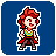

---
tags:
  - pixel art
  - rivals of aether
  - solana
---

# Rendition 037 – Rivals of Aether Mockup (2023-07-03)

## Overview

My characters are at a place where they are narratively settled. In other words, they have evolved to a point where I don't feel an urge to work on them. That's not to say their story ended. Rather, the significance is that I can focus my time on ideas sitting in my backlog.

One such idea was a set of palette swaps for Solana. Previously, I had created two such sets for Vic [1](../2022-h2/2022-10-12_rendition-025_fighting-game-palettes.md), [2](../2023-q1/2023-02-12_rendition-030_fighting-game-palettes.md), and I had plans for Solana. Thus, I started creating a sprite of her for this purpose.

Initially, I planned to create a large-scale sprite, similar to the previous palette swap sprites. While working on this sprite, however, I grew dissatisfied with Solana's pose, so I abandoned it. Instead, I created a sprite in the style of _Rivals of Aether_, [complementing Vic's](../2023-q1/2023-02-22_rendition-031_rivals-of-aether-mockup.md). This sprite was much quicker to finalize, only taking two hours.

The sprite presented in this post is the final product.

## WIPs

- [1](https://cdn.discordapp.com/attachments/1031694106717589544/1125576386153807974/image.png)
- [2](https://cdn.discordapp.com/attachments/1020875112045613217/1125592041049567352/image.png)
