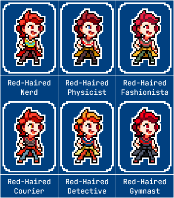

---
tags:
  - palette swap
  - pixel art
  - solana
---

# Rendition 038 – Fighting Game Palettes (2023-07-03)

## Overview

This image acts as the third iteration of palette swap references ([1](../2022-h2/2022-10-12_rendition-025_fighting-game-palettes.md), [2](../2023-q1/2023-02-12_rendition-030_fighting-game-palettes.md)). In each iteration, I create a sprite of one of my characters, then create palette swaps of the sprite in reference to other characters with similar tropes. In this iteration, I focused on Solana.

These palettes take inspiration from characters with similar tropes to Solana, which I will explain below.

## Explanation

When determining which characters to reference, I considered a large number of characters. In the end, I found I could only commit to characters that share the following traits:

- has red hair
- is a major character
- is competent
- is female
- is partnered
- is wholesome

| Name                   | Reference                                |
| ---------------------- | ---------------------------------------- |
| Red-Haired Nerd        | (default)                                |
| Red-Haired Physicist   | Kurisu Makise (_Steins;Gate_)            |
| Red-Haired Fashionista | Shiki Misaki (_The World Ends With You_) |
| Red-Haired Courier     | AE3803 (_Cells at Work!_)                |
| Red-Haired Detective   | Lynne (_Ghost Trick_)                    |
| Red-Haired Gymnast     | Kasumi Yoshizawa (_Persona 5 Royal_)     |

## Scrapped ideas

Characters who did not fit the desired criteria include:

- Chisa Yukizome (_Danganronpa 3_)
- Ed (_Cowboy Bebop_)
- Elliot Torres (_Blood Stain_)
- Futaba Sakura (_Persona 5_)
- Gina (_Corpus Mali_)
- Valerie Frizzle (_The Magic School Bus_)
- various _Avatar: The Last Airbender_ characters
- various _Genshin Impact_ characters
- various _Land of the Lustrous_ characters
- various _My Hero Academia_ characters
- various _Pokémon_ characters (Mela, Misty, Sonia)
- various _Steven Universe_ characters
- various _Touhou_ characters
- Yoko Littner (_Tengen Toppa Gurren Lagann_)

## Design notes

- Font: JetBrains Mono
- Background color: #004080
- As Solana is not a character to engage in clever wordplay, her palette swap names lack the cleverness of Vic's.

<!--
- AE3803: X In Vain?
- Astrolotl: Shooting Star?
- Kasumi Yoshizawa: X Personified
- Kurisu Makise: Schrödinger's X?
- Lynne: Chicken?
- Shiki Misaki: Threaded Mode
- Yoko Littner: Spiral Agent?
-->
