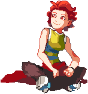

---
tags:
  - pixel art
  - solana
---

# Rendition 039 – Solana Sprite (2023-07-02)

## Overview

When creating a sprite for [Solana's color palettes](2023-07-05_rendition-038_fighting-game-palettes.md), I wanted to use a large-scale sprite originally. When working on the sprite, however, I encountered several difficulties; the pose was too passive for a sprite ostensibly for a fighting game, and I could not pose the legs as desired. Thus, I abandoned this sprite in favor of a smaller, simpler sprite.

The image depicted here represents the last snapshot of the original, large-scale sprite.

## WIPs

- [1](https://cdn.discordapp.com/attachments/1031694106717589544/1125136876513284146/image.png)
- [2](https://cdn.discordapp.com/attachments/1031694106717589544/1125242310800711761/image.png)
- [3](https://cdn.discordapp.com/attachments/1031694106717589544/1125265441326108692/image.png)
