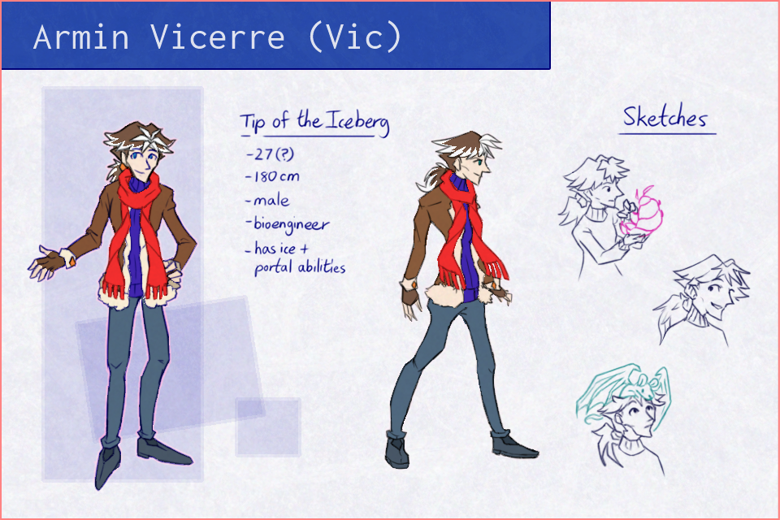

---
tags:
  - character design
  - isopod
  - lab rat
  - vicerre
  - vicerre ref
---

# Illustration 022 – Vic Character Sheet (2023-07-05 – 2023-07-06)

## Overview

Among the art skills I want to hone is the skill of human anatomy. I had a tenable grasp of the subject already, but I felt like my abilities had reached a plateau with my current resources. In order to improve, I had to seek more advanced resources.

When I asked [art_of_caleb](https://twitter.com/art_of_caleb) for resource recommendations, he gave a glowing recommendation for Michael Hampton's book _Figure Drawing: Design and Invention_. I quickly found a copy and began to read. Within a short number of pages, I had sketched several figures using Vic as my subject.

While I sketched, I realized these figures made for excellent reference material, then decided to adapt these figures into a character sheet. I wanted to adapt these figures for two reasons:

1. Since I posted [my original concepts for Vic's evolved design](../2022-h2/2022-10-18_illustration-009_evolved.md), I have made adjustments I wanted to capture formally. For example, the lining on Vic's jacket has become thicker, as captured in [my Pokémon-style sprite of him.](../2023-q2/2023-05-06_rendition-034_pokemon-character-sprites.md)
2. Vic's character development has settled in a way I could create a character sheet without it becoming immediately obsolete.

This image acts as the final result of those exercises.

## Design notes

- One of Vic's design motifs is the diamond shape. The shape can be found in his hairstyle, cufflinks, scarf, linework, and negative space. I knew from past resources diamond shapes were antithetical to flow in design, which gave Vic an awkward flow whenever I drew him.

  What I hadn't realized was how the same principle applied to gesture. If I wanted to draw Vic gesturally, I would need to undo part of this motif. Due to recent advances in characterization, I found I did not mind making changes. In contrast to his previous character reference, for example, you can see how his scarf now lacks convergence points, or how he stands less rigidly.

- The leftmost drawing was inspired by page 21 of the book. The center drawing was inspired by page 16 of the book.
- As Vic has matured in personality and ability, I found it fitting to make visual changes to his design:
  - The white hair on his head has spread from the center of his forehead to other hair tips. These white hairs are not due to natural aging but instead due to the growth of his ice abilities.
  - His eyes are more relaxed in shape. While Vic has had sharper-looking eyes in previous iterations, his eyes now have a rounded, almost droopy appearance.

## Resources used

- Background texture: [Cracked ice texture](https://www.crushpixel.com/stock-photo/_-777991.html)
- [Gregor Gregorovic – Refsheet](https://www.artstation.com/artwork/22XDA)
- [Illustration 001](../2021/2021-06-30_illustration-001_character-reference.md)
- Title font: [Inconsolata](https://fonts.google.com/specimen/Inconsolata)

## WIPs

- [1](https://cdn.discordapp.com/attachments/1031694106717589544/1126323044730810440/image.png)
- [2](https://cdn.discordapp.com/attachments/1031694106717589544/1126507926551548004/image.png)
