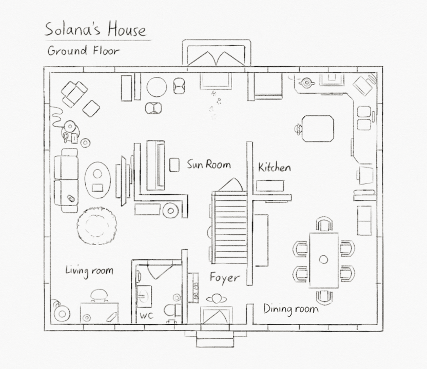

---
tags:
  - floor plan
  - solana
---

# Illustration 023 – Solana's House – Ground Floor – Floor Plan (2023-07-08)

## Overview

Among the major settings of my narrative, Solana's house is best equipped for slice-of-life stories. Hence, many Vignettes take place there. Also for this reason, I have a very clear idea of what Solana's house looks like.

Separately, I sought out art resources. I wanted to improve my anatomy and composition, but I was interested in consuming advanced material in general.

As a starting point, I searched for resources people used alongside [Fundamentals of Lighting with Sam Nielson](https://schoolism.com/courses/concept-art/fundamentals-of-lighting-sam-nielson). This brought me to [RadioRunner's Curriculum for the Solo Artist](https://www.brendanmeachen.com/soloartist) and then Scott Robertson's book "How to Draw".

Considering the uncomplicated book title, I expected much from it. Indeed, as I found while perusing, it proved to be a very thorough technical guide. Given its highly-technical nature, however, I did not find the book an exact match for my purposes. However, I found its techniques and exercises helpful as a framing device.

This book motivated me to draft a floor plan for Solana's house, as depicted here.

## Design notes

- Coming into this exercise, I had zero experience with residential architecture and interior design. I never designed a house before—not even in a video game like _Animal Crossing_, _Minecraft_, or _The Sims_, much less in art. While performing this exercise, I learned much about the design process.
- When hashing out rooms initially, I had trouble keeping scale accurate without a fixed point of reference. For this purpose, I found it highly helpful to include a human figure as a size reference. After including a human figure, the design of the floor fell into place, and following that, its furniture.
- When laying out rooms, I learned much about the unspoken rules of architecture. For instance, I considered:
  - The orientation of doors. When placing doors, I had to consider which orientation was most convenient to open or close each door.
  - Room transitions. For instance, when creating a space for the ground floor bathroom, I considered how bathrooms often open into a hallway rather than directly into another room.
  - Interior vs. exterior design. Solana's house is symmetrical, but the inside is not. When considering how to place walls and windows, I had to ensure the rooms inside meshed with the edifice outside.
  - User journeys. The focal points of each room should be positioned such that a visitor can see them upon entering the home. However, they should not be in locations that obstruct pathing between rooms.
- House furniture selection is a reactive process, not a proactive one. In other words, the furniture that belongs in a character's place should be a product of the character. If you need to force yourself to add furniture, you don't have enough information about the character's habits.
- When determining the placement of furniture, I thought about what would be the most natural placement for a resident. For instance:
  - Consider first a list of "standard" furniture. A living room has chairs, tables, and entertainment. A kitchen has a counter, fire extinguisher, range, refrigerator, and sink. Multiple rooms can have cabinets, clocks, and lamps.
  - Solana would want a small end table next to the couch to grab stuff while lounging.
  - Solana would not want to obstruct windows with tall cabinets.
  - Solana has a sun room (for tea) and various animal care items (like a bed and brush for Clementine).
  - As mentioned in previous passages, Solana has [a couch](../2022-h2/2022-11-11_icebreaker-041-042-043.md) and [a piano](../2021/2021-12-23_rendition-012_river-song.md).

## Miscellaneous notes

- This exercise gave me an idea of things to look for when surveying a place when buying or renting.
- I still don't quite understand _feng shui_, but, following this exercise, I think I have a better idea of what it entails.

## Resources used

- [Kyle's Very Nice Paper Layer (Dark)](https://kyletwebster.gumroad.com/l/ZHvXw)
- [Sample main floor plan for a small family home](https://en.wikipedia.org/wiki/Floor_plan#/media/File:Sample_Floorplan.jpg)

## WIPs

- [1](https://cdn.discordapp.com/attachments/1031694106717589544/1127288053434687560/image.png)
- [2](https://cdn.discordapp.com/attachments/1031694106717589544/1127331995438026752/image.png)
- [3](https://cdn.discordapp.com/attachments/1020875112045613217/1127359439062695956/image.png)
