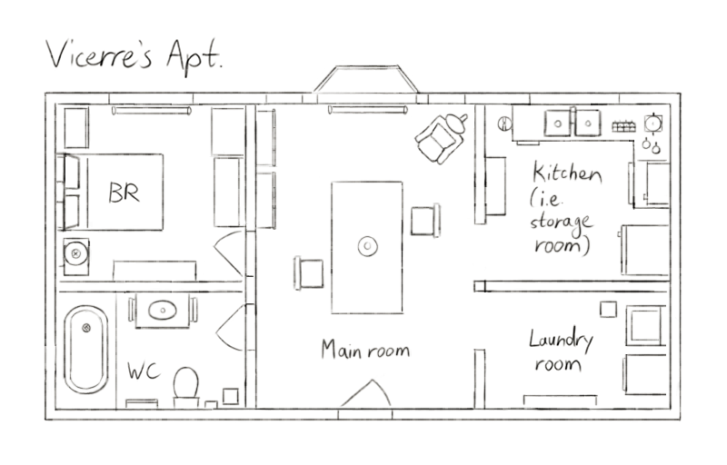

---
tags:
  - floor plan
  - vicerre
---

# Illustration 024 – Vic's Apartment – Floor Plan (2023-07-15)

## Overview

Following [the previous passage,](2023-07-16_vignette-035_midsummer-night.md) I was inspired to draw the floor plans for Vic's apartment. [Like Solana's house,](2023-07-09_illustration-023_floor-plan.md) I have a clear idea what Vic's apartment looks like, so this image was quick to produce.

## Design notes

- Vic doesn't invest as much in his apartment as the lab. He needs a place to sleep, naturally, but he doesn't make the rest of the space his home. To wit, the main room and kitchen are effectively unused.
- Vic has a fire escape outside the bedroom window. I did not depict it in the image, as I considered its inclusion confusing.

## Resources used

- [Kyle's Very Nice Paper Layer (Dark)](https://kyletwebster.gumroad.com/l/ZHvXw)

## WIPs

- [1](https://cdn.discordapp.com/attachments/1031694106717589544/1129987306628075550/image.png)
- [2](https://cdn.discordapp.com/attachments/1031694106717589544/1130000795753000960/image.png)
- [3](https://cdn.discordapp.com/attachments/1020875112045613217/1131374235219140638/tmp.png)
