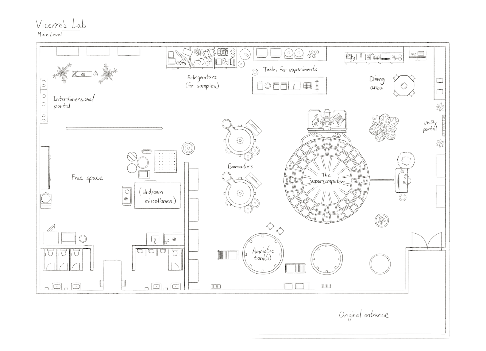

---
humorous:
  - spider plant
  - spider plant
  - does whatever a spider plant does
  - TIL about the word "effluent".
tags:
  - floor plan
  - vicerre
---

# Illustration 025 – Vicerre's Lab – Main Floor – Floor Plan (2023-07-12 – 2023-07-19)

## Overview

Since I sketched out [a floor plan for the ground floor of Solana's house](2023-07-09_illustration-023_floor-plan.md), I felt more comfortable drawing additional floor plans. Thus, I extracted my mental image of Vic's lab and placed it onto canvas.

## Design notes

- Overall, my mental image of the lab is fuzzier than that of other locations. This is, of course, because I am less familiar with bioengineering spaces—much less stylized, fictional ones.

  In planning out lab appearance, I referred to a mix of real-world spaces and fictional ones.

- In determining lab layout, I referenced [Elucidation 017](../2023-q1/2023-01-17_elucidation-017_lab.md) and [Illustration 019](../2023-q2/2023-04-27_illustration-019_microwave.md).
- In determining where fixtures should go, I considered what people would see from Vic's desk, Solana's desk, and the interdimensional portal.
- The lab contains an extensive plumbing system. Pipes that transport fluids used in bioengineering run everywhere along the walls and floor.
- The lab contains much miscellaneous cruft not depicted on the floor plan.
- One of the plants in the lab is a _monstera_. Vic would find its leaf holes interesting, and he would enjoy having a monstrous _monstera_ around.
- In determining how to draw plants, I spaced leaves out using the golden angle.
- The floor of the lab is slightly slanted to allow liquids to drain.

## Resources used

In researching what belongs in a bioengineering space, I searched for the following terms online:

- bioreactors
- data center rack circular layout
- industrial microwave systems
- industrial floor scale
- modern dna sequencing tools

In addition, I referenced the following pages:

- [6 Types Of Bioreactors](https://atlas-scientific.com/blog/types-of-bioreactors/)
- [Electrolab Biotech](https://www.electrolabtech.co.uk/)
- [Workstream by Monoprice Triple Monitor Gas Spring Mount for up to 32in Screens, Fully Adjustable Center Mount ](https://www.monoprice.com/product?p_id=29407)

In addition, I used the following assets:

- [Kyle's Very Nice Paper Layer (Dark)](https://kyletwebster.gumroad.com/l/ZHvXw)

## WIPs

- [1](https://cdn.discordapp.com/attachments/1031694106717589544/1128871025673777203/image.png)
- [2](https://cdn.discordapp.com/attachments/1031694106717589544/1129223513182576764/image.png)
- [3](https://cdn.discordapp.com/attachments/1031694106717589544/1130310952114471003/image.png)
- [4](https://cdn.discordapp.com/attachments/1031694106717589544/1131065988260057169/image.png)
- [5](https://cdn.discordapp.com/attachments/1020875112045613217/1131374235470794904/tmp1.png)
