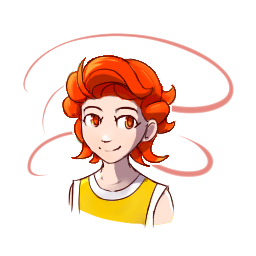

---
tags:
  - solana
  - vicerre
---

# Rendition 040 – Clip Studio Paint (2023-07-28)

## Overview

I recently wanted to draw gift art for a friend of mine. In doing so, I desired perspective lines. Unfortunately, Adobe Photoshop lacks built-in means of drawing perspective guidelines. If I wanted to use Adobe Photoshop, I would need a makeshift solution.

When searching for alternate solutions, I saw a recommendation for Clip Studio Paint. I knew Clip Studio Paint was popular, as it was used commonly by talented artists on Pixiv, Tumblr, and Webtoon. As I was frustrated with Adobe Photoshop's limitations, I decided to try it out.

To practice drawing in Clip Studio Paint, I drew Vic, my standard subject. The image in this post represents one of these drawings.

## Design notes

While drawing in Clip Studio Paint, I noted how this program differed from Adobe Photoshop:

Pros:

- The UI and keyboard shortcuts translate well from Adobe Photoshop. Given minor adjustments, a person familiar with Adobe Photoshop's workflow will adapt easily to Clip Studio Paint.
- Tools such as brush size and stroke width use floating-point precision instead of integer precision. This allows for finer control over images.
- The Auto Select tool is more intelligent than that of Photoshop. Whereas the Magic Wand tool in Photoshop relies on exact tolerances, the Auto Select Tool in Clip Studio Paint can select regions that are not perfectly connected.
- Layer Masks are more intuitive compared to Photoshop. In Photoshop, I always found it odd how applying a layer mask required you to draw in the parts to be erased. In contrast, using the Clip Studio Paint model, you erase the part of the image that should be erased.
- The Mesh Transform tool can be used on multiple layers. In contrast, Photoshop only allows the Warp tool to be used over a single layer.
- Graphical transformations were much more performant. Tools such as blending and applying filters were much faster to run in Clip Studio Paint than in Photoshop. On Photoshop, these tools run on the GPU, while on Clip Studio Paint, they run on the CPU.

Cons:

- Layer Property > Border Effect: This tool lacks fine-grain control over falloff shape. If I want to apply an inner glow layer effect (which uses a quadratic falloff), I need alternate tools. This is suboptimal, as I would prefer a layer effect that automatically updates as I make changes.
- Clip Studio Paint lacks a History Snapshot tool. If I need to restore an image to a "last good" state, I need to use workarounds, such as reverting to my previous save file or creating another layer. Anyone familiar with version control tooling can sympathize with the lack of ability to revert to a last good save.
- Clip Studio Paint lacks a robust library of image interpolation methods. My favorite image interpolation method when transforming selections is Bicubic Sharper, which preserves clarity when scaling up. Clip Studio Paint lacks an algorithm that suits my needs.
- Clip Studio Paint lacks robust support for non-destructive filters. In Photoshop, I can convert raster layers to Smart Layers, then apply any number of filters to them non-destructively. I cannot perform the same sequence of events in Clip Studio Paint.
- The mesh transform tool lacks the sophistication of Photoshop's.
- Clip Studio Paint lacks a convenient method of drawing horizontal and vertical lines with dynamic pressure. In Photoshop, I can simply hold the Shift key when drawing a stroke to lock it to a horizontal or vertical path. There is no equivalent in Clip Studio Paint, and [the closest workaround](https://www.reddit.com/comments/xpdm9w) is clunky at best.

## Bonus sketch – Solana Drawing

