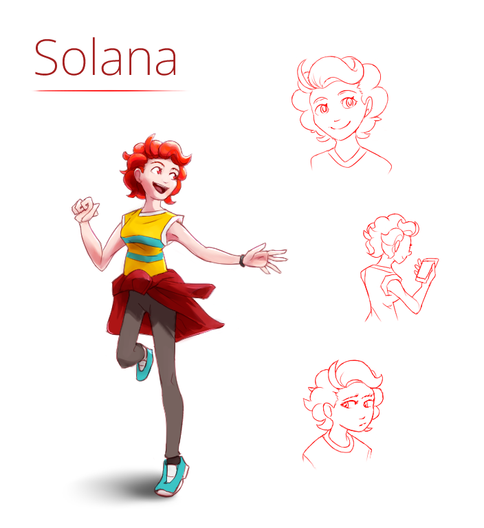

---
tags:
  - character design
  - solana
---

# Illustration 029 — Solana Character Sheet (2023-08-04 – 2023-08-06)

## Overview

Solana is a prominent character in my narrative. She is a character who appears in many passages and illustrations, yet she is not one I have often drawn in full. I've drawn Vic, another major character in my narrative, many times. In contrast, I've drawn Solana in full only twice [1](../2021/2021-11-13_illustration-002_solana.md), [2](../2022-h2/2022-11-12_illustration-012_outfits.md).

I wanted to provide an updated reference image for her, so I drew one.

## Design notes

- Title font: [Noto Sans 200](https://fonts.google.com/noto/specimen/Noto+Sans)

## WIPs

- [1](https://cdn.discordapp.com/attachments/261586968230494219/1137182293610483795/image.png)
- [2](https://cdn.discordapp.com/attachments/261586968230494219/1137211233112694894/image.png)
- [3](https://cdn.discordapp.com/attachments/261586968230494219/1137216608004214814/image.png)
- [4](https://cdn.discordapp.com/attachments/1031694106717589544/1137561655459459152/image.png)
- [5](https://cdn.discordapp.com/attachments/1031694106717589544/1137863301586501642/image.png)
