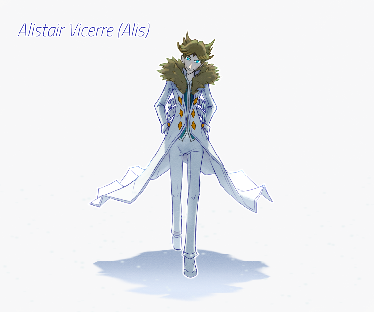
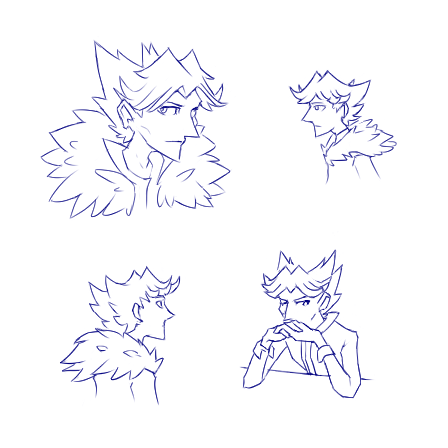

---
tags:
  - alis
  - character design
---

# Illustration 030 – Alis Character Sheet (2023-08-09 – 2023-08-13)

## Overview

To round out my recent set of character sheets[1](2023-07-08_illustration-022_character-sheet.md), [2](2023-08-06_illustration-029_character-sheet.md), I created a character sheet for the latest major character in my narrative, Alis. [As I had recently redesigned him,](../2023-q2/2023-06-14_illustration-021_alis.md) I thought this was an excellent opportunity to draw him in more detail.

## Design notes

In [Icebreaker 027](../2022-h2/2022-10-11_icebreaker-024-025-026-027.md), I discussed which fonts best suit my characters. During that time, Alis had not joined the cast as a main character. When composing this character sheet, I had to consider the qualities of a font that best fit his personality.

As Alis is, in part, a variation on Vic, I sought fonts with similar qualities to Vic's fonts. In particular, I desired the following qualities:

- Like how Alis's temperament is unwavering, the font must have a consistent stroke thickness.
- As Alis prefers to work from the shadows, the font must have a light stroke width.
- Considering the urban fantasy setting of the narrative, the font cannot be too classical, futuristic, gaudy, or stylish.
- As Alis is a narrow character, the glyphs that compose the font must be somewhat narrow.
- As Alis is a deviation of another character, he uses an italicized font style instead of the default.

In the end, I found the following fonts to suit these criteria:

- [Bitter](https://fonts.google.com/specimen/Bitter): A clean, classy font with acute serifs.
- [Chakra Petch](https://fonts.google.com/specimen/Chakra+Petch): A mechanical-looking font composed of 45- and 90-degree lines.
- [Titillium Web](https://fonts.google.com/specimen/Titillium+Web): A modern font with interesting clipped vertices.

In the end, I selected Titillium Web Light 300 Italic. I enjoyed how the clipped vertices on the "A" and "V" in Alis's name contrast with the tapered "A" and "V" in [Vic's character sheet.](2023-07-08_illustration-022_character-sheet.md)

## Resources used

- [Kyle's Very Nice Paper Layer (Dark)](https://kyletwebster.gumroad.com/l/ZHvXw)
- New tools used:
  - Blend: Finger tip

## WIPs

- [1](https://cdn.discordapp.com/attachments/1031694106717589544/1139019708130148412/image.png)
- [2](https://cdn.discordapp.com/attachments/1031694106717589544/1139386604570546206/image.png)
- [3](https://cdn.discordapp.com/attachments/1031694106717589544/1140335808793038898/image.png)

## Bonus sketches

