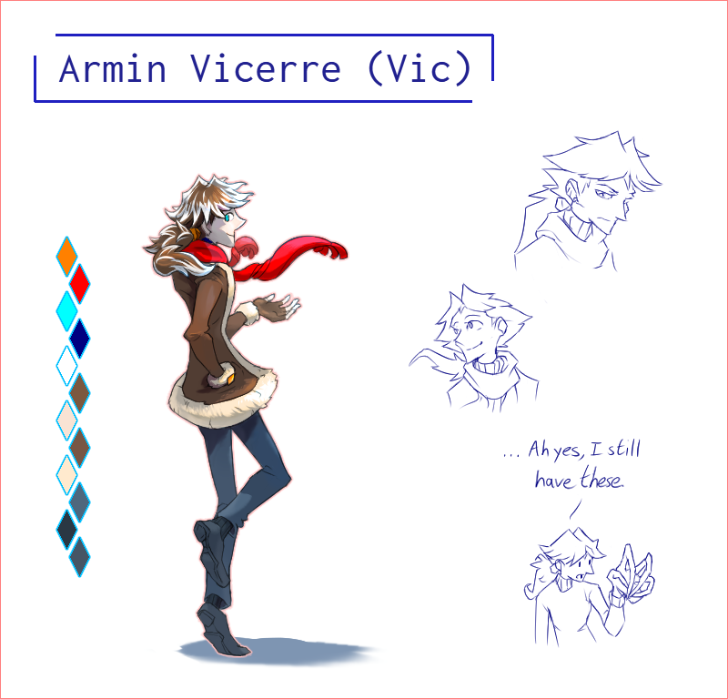

---
tags:
  - character design
  - vicerre
---

# Illustration 031 – Vicerre Character Sheet (2023-08-18 – 2023-08-20)

## Overview

Following the character sheets I drew for [Alis](2023-08-13_illustration-030_character-sheet.md) and [Solana](2023-08-06_illustration-029_character-sheet.md), I sought to draw one for Vic.

Now, [I drew a character sheet for Vic recently,](2023-07-08_illustration-022_character-sheet.md) and by all standards, it is reasonably up-to-date. However, since I started drawing in Clip Studio Paint instead of Adobe Photoshop, I desired consistency between my reference images. For this reason, I drew another character sheet for Vic.

## Design notes

- Title font: [Inconsolata](https://fonts.google.com/specimen/Inconsolata)

## WIPs

- [1](https://cdn.discordapp.com/attachments/1031694106717589544/1141868955875688640/image.png)
- [2](https://cdn.discordapp.com/attachments/1031694106717589544/1141914871210967050/image.png)
- [3](https://cdn.discordapp.com/attachments/1031694106717589544/1142073186356310117/image.png)
- [4](https://cdn.discordapp.com/attachments/1031694106717589544/1142297072352112820/image.png)
- [5](https://cdn.discordapp.com/attachments/1031694106717589544/1142932403782950922/image.png)
