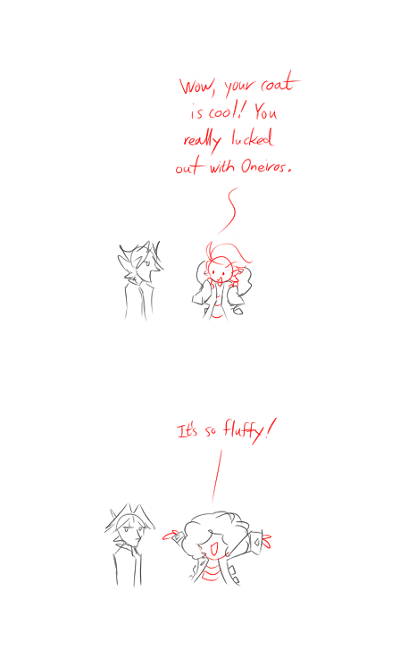

---
meta:
  - corn
  - fluffy
  - piano
tags:
  - alis
  - solana
  - vicerre
---

# Doodle 001 – Art Anatomy (2023-08-20)

([Inspiration](https://twitter.com/mcapriglioneart/status/1685687719899402240))

# Doodle 002 – The Best Use of Claws (2023-08-21)

# Doodle 003 – Cat Food (2023-08-21)

[non-canon]

# Doodle 004 – Winter Coat (2023-08-24)

## Overview

I've developed my art skills to the point where I feel comfortable drawing multiple characters over multiple panels. To supplant my writing, I started drawing small doodles of my characters with scenarios I found entertaining.

## WIPs

- [1](https://cdn.discordapp.com/attachments/1031694106717589544/1142984189701017710/image.png)
- [2](https://cdn.discordapp.com/attachments/1031694106717589544/1143158713763504249/image.png)
- [3](https://cdn.discordapp.com/attachments/1020875112045613217/1143340880581906512/image.png)
- [4](https://cdn.discordapp.com/attachments/1031694106717589544/1144448206323855431/image.png)
