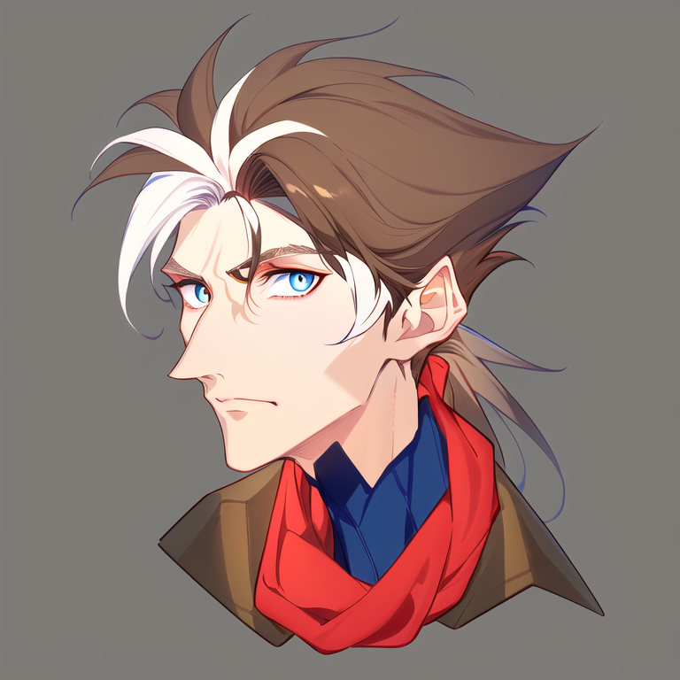

---
tags:
  - ai art
  - vicerre
---

# Meta 010 – Stable Diffusion Testing



## Overview

When I experimented with Stable Diffusion, I generated a number of images of Vicerre. Among those generations is an image I'm especially fond of and keep returning to study, which I have presented here.

The elements I find interesting are the following:

- Vicerre's intense, melancholic expression. I would like to replicate this expression using my own skill set.
- The art style. I would like to capture Vic's depiction here in my own style.

## Workflow

- Model: Anything v3 + VAE
- Seed range: `1364821611`
- Original image: ([1](assets/2022-12-29_image-071.png))
- Batch count: 1
- Batch size: 6
- Prompt:

```
masterpiece,high quality,best quality,highest detail,4k,((male)),(((high cheekbones))),narrow,thin,long face,pointy,angular,messy hair,((brown hair)),white hair accent,tentatively curious,blue eye,skrunkly,turtleneck,thick winter coat,thick red scarf,hairtie
Negative prompt: nsfw, lowres, (bad anatomy:1.21), bad hands, text, error, missing fingers, extra digit, fewer digits, cropped, worst quality, low quality, normal quality, jpeg artifacts, signature, watermark, username, blurry, artist name
Steps: 50, Sampler: Euler a, CFG scale: 15, Seed: 1364821611, Size: 768x768, Model hash: 6569e224, Batch size: 6, Batch pos: 4, Denoising strength: 0.5, Mask blur: 4
```
