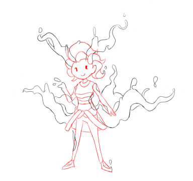

---
humorous:
  - tyndall effect
tags:
  - solana
---

# Illustration 032 – Decayed Solana (2023-08-30)

## Overview

At the time of writing, my narrative universe is undergoing spacetime instability. As Solana is made of 'universe', these instabilities are reflected in her appearance. Thus, I drew what her appearance might look like for narrative purposes.

As Solana is made of 'universe', I imagined her instabilities would resemble space. Thus, the particles she emits would look like dark flecks that scatter light. In addition, as implied in [Vignette 040](2023-07-31_vignette-040_particulars.md), she would leave long emissions at her temples and the base of her spine.

Admittedly, when I wrote Vignette 040, I didn't have a strong idea what those emissions were an indication of. I imagined Solana could unlock supernatural abilities and gain an aura in the future. When the narrative universe started to destabilize, however, I could see no better option than to give Solana a dramatic visual to reflect her state.

## Inspirations

- _What If...?_, season 1, episode 4

## WIPs

- [1](https://cdn.discordapp.com/attachments/1031694106717589544/1146573791544234035/image.png)
