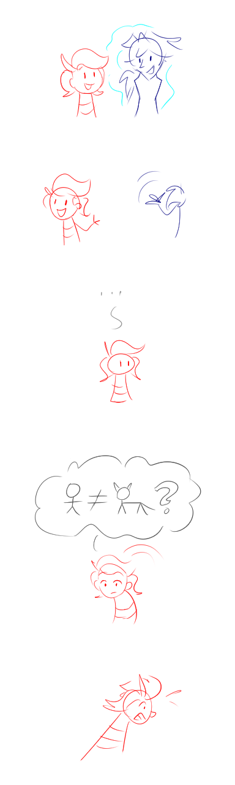
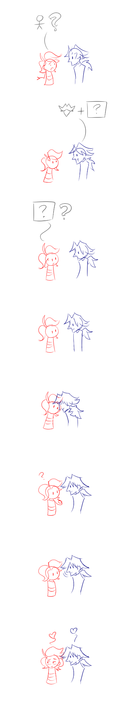

---
tags:
  - solana
  - vicerre
---

# Doodle 005 – The Trigger (2023-09-26)

---

## Overview

For the final post in this narrative arc, I decided to show the aftermath of Vic regaining his human form. Instead of writing a Vignette as I usually do, I depicted events through a wordless comic instead.

These images depict this narrative sequence. In this comic, Solana realizes Vic is human again, asks him why, and learns how she shaped his soul.

## Design notes

These images serve as my first exercise in creating a long-form visual narrative. Whereas previous visual narratives consisted of one or two panels [1](../2021/2021-11-29_illustration-005_nerds.md), [2](../2022-h2/2022-10-14_illustration-008_interactions.md), [3](2023-08-25_doodle-001-002-003-004.md), these images consist of many panels.

Telling a story through a visual medium comes with changes enforced by the medium:

- Beats that are visual become easier to visualize. Expressions, for instance, are easier to draw than describe.
- Beats that must be written to achieve effect require extra effort to visualize. For example, characters' thoughts and feelings must be expressed visually.
- This comic uses no written language. Whereas it's usually possible to use text as an escape hatch for visual storytelling, this option was constrained here.

Due to the changes this medium enforces, this comic required narrative concessions.

## WIPs

- [1](https://cdn.discordapp.com/attachments/1031694106717589544/1156348243156942848/image.png)
- [2](https://cdn.discordapp.com/attachments/1031694106717589544/1156406348381167616/image.png)
