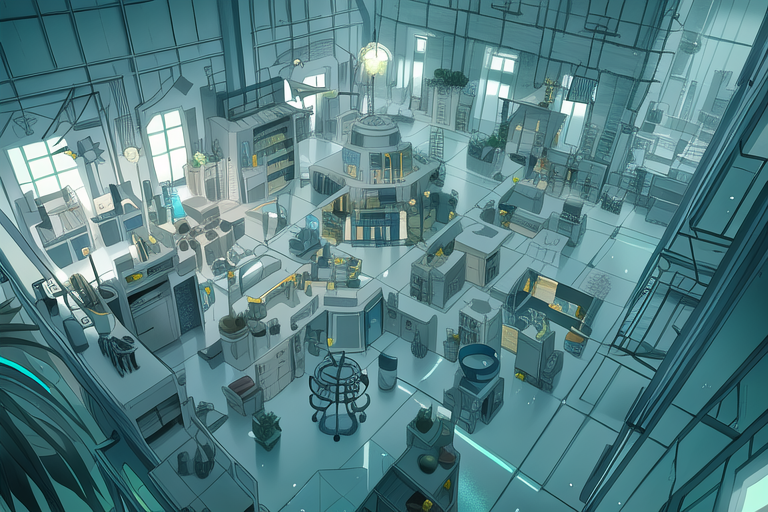

---
tags:
  - ai art
---

# Meta 012 – Stable Diffusion Mood Boards

## Overview

A well-composed setting is important when writing narrative media. Not only does an engaging setting add depth to the universe of that narrative, but it also shapes the narrative itself. When I write my universe, I often consider the setting characters inhabit.

In prior posts, I sketched out floor plans for my universe's major settings. While these images are effective starting points for developing settings, I would like to develop these settings in other ways.

At the time of writing, I do often not draw background art. However, I still want to share ideas for major settings in my universe. As an interim solution, I've used Stable Diffusion to generate ideas for each setting. In the future, I would like to draw my own background art.

The images in this post consist of background art generated in Stable Diffusion. Each image acts as an element for a mood board, so the prompt for each image places emphasis on lighting and set dressing.

Each image is generated with the Anything V3 model using Automatic1111's UI, and workflows are listed alongside each image.

## Overview – Results

### Alis's Apartment

| Generation                                  | Positive Prompt                                                                                                                                                                                                                                                                                                                           | Negative Prompt                                                                                                                                                                                                                   | Workflow                                                                                                                       |
| ------------------------------------------- | ----------------------------------------------------------------------------------------------------------------------------------------------------------------------------------------------------------------------------------------------------------------------------------------------------------------------------------------- | --------------------------------------------------------------------------------------------------------------------------------------------------------------------------------------------------------------------------------- | ------------------------------------------------------------------------------------------------------------------------------ |
|  | a busy studio with a varied collection of complicated sci-fi chemical equipment in an old quaint Florentine, eye level, (lived-in: 1.3), occupied, sophisticated, dusty, messy, (disorganized: 1.3), unkempt, dirty yellowing stucco walls, large arched window, PVC pipes, warm lighting, colorful sketch, concept art, no_humans        | nsfw, error, worst quality, low quality, normal quality, jpeg artifacts, signature, watermark, username, blurry, artist name, artist, fisheye lens, abandoned, chandelier, moss, humanoid, cyborg                                 | Steps: 20, Sampler: Euler a, CFG scale: 15, Seed: 1772035032, Size: 768x512, Model hash: 6569e224, Batch size: 6, Batch pos: 4 |
|  | a studio with a varied collection of advanced complicated tinkercore sci-fi biochemical equipment in an old quaint Florentine, (lived-in: 1.3), occupied, sophisticated, dusty, messy, (disorganized: 1.3), unkempt, dirty yellowing stucco walls, large arched window, PVC pipes, warm lighting, colorful sketch, concept art, no_humans | nsfw, error, worst quality, low quality, normal quality, jpeg artifacts, signature, watermark, username, blurry, artist name, artist, fisheye lens, abandoned, chandelier, moss, humanoid, cyborg, person, characters             | Steps: 20, Sampler: Euler a, CFG scale: 15, Seed: 1446266248, Size: 768x512, Model hash: 6569e224, Batch size: 6, Batch pos: 0 |
|  | a studio with a varied collection of sci-fi biochemical machinery in an old quaint Florentine, (lived-in:1.3), occupied, sophisticated, dusty, messy, (disorganized: 1.3), unkempt, dirty yellowing stucco walls, large arched window, PVC pipes, warm lighting, colorful sketch, concept art, no_humans                                  | nsfw, error, worst quality, low quality, normal quality, jpeg artifacts, signature, watermark, username, blurry, artist name, artist, fisheye lens, abandoned, chandelier, moss, modern-day, humanoid, cyborg, person, characters | Steps: 20, Sampler: Euler a, CFG scale: 15, Seed: 2225416808, Size: 768x512, Model hash: 6569e224, Batch size: 6, Batch pos: 2 |
|  | a studio with a varied collection of sci-fi biochemical machinery in an old quaint Florentine, (lived-in:1.3), cables, occupied, sophisticated, dusty, (disorganized: 1.3), dirty yellowing stucco walls, large arched window, PVC pipes, warm lighting, colorful sketch, concept art, no_humans                                          | nsfw, error, worst quality, low quality, normal quality, jpeg artifacts, signature, watermark, username, blurry, artist name, artist, fisheye lens, abandoned, chandelier, moss, modern-day, humanoid, cyborg, person, characters | Steps: 20, Sampler: Euler a, CFG scale: 15, Seed: 1041975785, Size: 768x512, Model hash: 6569e224, Batch size: 4, Batch pos: 2 |

### Solana's House

| Generation                                  | Positive Prompt                                                                                                                                                                                                                           | Negative Prompt                                                                                                                                                                                                               | Workflow                                                                                                                       |
| ------------------------------------------- | ----------------------------------------------------------------------------------------------------------------------------------------------------------------------------------------------------------------------------------------- | ----------------------------------------------------------------------------------------------------------------------------------------------------------------------------------------------------------------------------- | ------------------------------------------------------------------------------------------------------------------------------ |
|  | plain living room, entryway, upright piano, english couch, coffee table, dark brown side table, table lamp, white ceiling, yellow curtains, beige walls, open windows, golden hour, red lighting, colorful sketch, concept art, no_humans | nsfw, error, worst quality, low quality, normal quality, jpeg artifacts, signature, watermark, username, blurry, artist name, vn, visual novel, grand piano, couches, wardrobe, curvilinear, artsy, stylish                   | Steps: 20, Sampler: Euler a, CFG scale: 15, Seed: 201867346, Size: 768x512, Model hash: 6569e224, Batch size: 6, Batch pos: 2  |
|  | plain living room, entryway, english couch, coffee table, side table, table lamp, upright piano, fireplace, white ceiling, yellow curtains, beige walls, open windows, golden hour, red lighting, colorful sketch, concept art, no_humans | nsfw, error, worst quality, low quality, normal quality, jpeg artifacts, signature, watermark, username, blurry, artist name, vn, visual novel, couches, wardrobe, grand, curvilinear, artsy, stylish, framed art, mirror, tv | Steps: 20, Sampler: Euler a, CFG scale: 15, Seed: 201867344, Size: 768x512, Model hash: 6569e224, Batch size: 3, Batch pos: 0  |
|  | cute living room, low angle shot, english couch, coffee table, side table, table lamp, fireplace, white ceiling, yellow curtains, beige walls, open windows, golden hour, red lighting, colorful sketch, concept art, no_humans           | nsfw, error, worst quality, low quality, normal quality, jpeg artifacts, signature, watermark, username, blurry, artist name, vn, visual novel, couches, wardrobe, curvilinear, artsy, stylish, framed art, mirror, tv        | Steps: 20, Sampler: Euler a, CFG scale: 15, Seed: 1969324019, Size: 768x512, Model hash: 6569e224, Batch size: 6, Batch pos: 1 |
|  | cute living room, low angle shot, english couch, coffee table, side table, table lamp, fireplace, white ceiling, yellow curtains, beige walls, open windows, golden hour, red lighting, colorful sketch, concept art, no_humans           | nsfw, error, worst quality, low quality, normal quality, jpeg artifacts, signature, watermark, username, blurry, artist name, vn, visual novel, couches, wardrobe, curvilinear, artsy, stylish, framed art, mirror, tv        | Steps: 20, Sampler: Euler a, CFG scale: 15, Seed: 1969324029, Size: 768x512, Model hash: 6569e224, Batch size: 6, Batch pos: 5 |

### Vic's Apartment

| Generation                                  | Positive Prompt                                                                                                                                                                                                                                                                                                     | Negative Prompt                                                                                                                                                                                 | Workflow                                                                                                                       |
| ------------------------------------------- | ------------------------------------------------------------------------------------------------------------------------------------------------------------------------------------------------------------------------------------------------------------------------------------------------------------------- | ----------------------------------------------------------------------------------------------------------------------------------------------------------------------------------------------- | ------------------------------------------------------------------------------------------------------------------------------ |
|  | old lived-in 1990s new york apartment, wide (bay window: 1.2), bay window seat, (worn:1.5) (traditional vintage wooden:1.05) furniture, bookshelf, dark steel blue (gray:1.2) walls, gray carpet, lamp, cozy, symmetrical, eye level, gloomy, stark, steelcore, sciencecore, colored sketch, concept art, no_humans | nsfw, error, worst quality, low quality, normal quality, jpeg artifacts, signature, watermark, username, blurry, artist name, vn, visual novel, fisheye lens, couch, chair, dutch angle, angled | Steps: 20, Sampler: Euler a, CFG scale: 15, Seed: 3655307975, Size: 768x768, Model hash: 6569e224, Batch size: 6, Batch pos: 4 |

### Vic's Lab

| Generation                                  | Positive Prompt                                                                                                                                                                                                                                                                      | Negative Prompt                                                                                                                                                                                                                                                           | Workflow                                                                                                                       |
| ------------------------------------------- | ------------------------------------------------------------------------------------------------------------------------------------------------------------------------------------------------------------------------------------------------------------------------------------ | ------------------------------------------------------------------------------------------------------------------------------------------------------------------------------------------------------------------------------------------------------------------------- | ------------------------------------------------------------------------------------------------------------------------------ |
|  | chemical lab, pale fluorescent lighting, mad science, lived-in, haphazard, disorganized, dusty, sophisticated, unkempt, tile, ample-sized, large-sized, roomy, spacious, indoors, (aerial view: 1.3), tinkercore, steelpunk, sciencecore, environment art, background art, no_humans | nsfw, error, worst quality, low quality, normal quality, jpeg artifacts, signature, watermark, username, blurry, artist name, (pipes: 0.4), visual novel, vn, medical, school, abandoned, cubicle, scaffolding, shelves, fisheye lens, humanoid, cyborg                   | Steps: 50, Sampler: Euler a, CFG scale: 15, Seed: 3950529025, Size: 768x256, Model hash: 6569e224, Batch size: 6, Batch pos: 1 |
|  | chemical lab, pale fluorescent lighting, mad science, lived-in, haphazard, disorganized, dusty, sophisticated, unkempt, open-floor plan, tiled floor, indoors, (aerial view: 1.3), tinkercore, steelpunk, sciencecore, environment art, background art, no_humans                    | nsfw, error, worst quality, low quality, normal quality, jpeg artifacts, signature, watermark, username, blurry, artist name, (pipes: 0.4), visual novel, vn, medical, school, abandoned, cubicle, scaffolding, shelves, fisheye lens, humanoid, cyborg                   | Steps: 50, Sampler: Euler a, CFG scale: 15, Seed: 3950529024, Size: 768x512, Model hash: 6569e224, Batch size: 6, Batch pos: 0 |
|  | chemical lab, pale fluorescent lighting, mad science, lived-in, haphazard, disorganized, dusty, sophisticated, unkempt, open-floor plan, tiled floor, indoors, (aerial view: 1.3), tinkercore, steelpunk, sciencecore, environment art, background art, no_humans                    | nsfw, error, worst quality, low quality, normal quality, jpeg artifacts, signature, watermark, username, blurry, artist name, (pipes: 0.4), visual novel, vn, medical, school, abandoned, cubicle, scaffolding, shelves, fisheye lens, humanoid, cyborg, organic, green   | Steps: 50, Sampler: Euler a, CFG scale: 15, Seed: 3127898091, Size: 768x512, Model hash: 6569e224, Batch size: 6, Batch pos: 1 |
|  | chemical lab, pale fluorescent lighting, mad science, lived-in, haphazard, disorganized, dusty, sophisticated, unkempt, open-floor plan, islands, tiled floor, indoors, (aerial view: 1.3), tinkercore, steelpunk, sciencecore, environment art, background art, no_humans           | nsfw, error, worst quality, low quality, normal quality, jpeg artifacts, signature, watermark, username, blurry, artist name, (pipes: 0.4), visual novel, vn, medical, sci-fi, school, abandoned, counters, cubicle, scaffolding, fisheye lens, humanoid, cyborg, organic | Steps: 50, Sampler: Euler a, CFG scale: 15, Seed: 3194153535, Size: 768x512, Model hash: 6569e224, Batch size: 6, Batch pos: 2 |

## Observations

- Alis's apartment is best depicted at eye-level. In contrast, Vic's lab is best depicted from an aerial angle.
- Alis's and Vic's apartments benefit from the `lived-in` keyword, whereas Solana's house does not use this keyword.
- Vic's lab benefits from the following keywords: `cramped`, `jumbled`.
