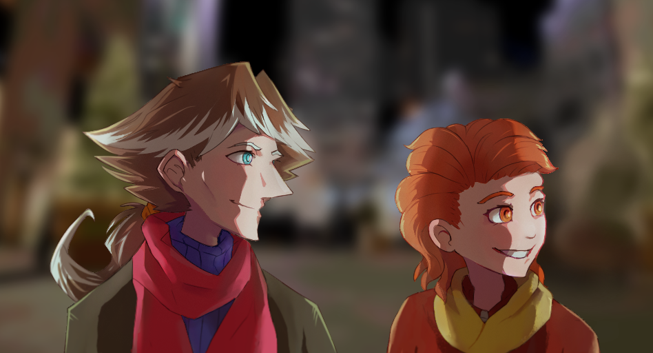

---
tags:
  - solana
  - vicerre
---

# Rendition 041 – Anime-Style Screencap (2023-10-07 – 2023-10-13)

## Overview

Recently, I wrote an involved arc in my narrative. From Vignette 044 to Illustration 066, the universe of my narrative was destabilized, and along with it, the status quo of my characters. After the universe returned to normal, my characters grew from the experience; Solana and Vic have affirmed their feelings for each other, and Alis has left his jaundiced worldview behind.

Writing this arc required me to be in a suboptimal headspace for one month; in that time frame, I had to work through Alis's convoluted thought processes and Solana's strained emotions. Following the arc's conclusion, I wanted a palate cleanser; instead of creating content driven by in-universe narrative, I wanted to create content driven by external motivations.

I thus decided to exercise my art skills: I would draw my characters in an animesque art style and ask for feedback on them.

I quickly realized, however, I could not share the image I was developing. I share art of my characters too often already, so I could not bring myself to share more. In turn, this turned the art exercise into an image of uncertain purpose. Thus, I ultimately worked on this image on my own.

Regardless of the outcome, I felt this exercise was productive; I enjoyed being able to focus on my universe in a casual setting, and I enjoyed developing my art abilities. In addition, while I'm not completely satisfied with my work, I'm pleasantly surprised by the result.

## Design notes

In other drawings, I draw characters first, then the background surrounding them. As this image was inspired by fake anime-style screencaps, I drew this image with framing and composition in mind from the start.

In retrospect, I found that working this way creates a far more cinematic composition than if I were to work on characters first. This also means, however, I have to plan for composition much earlier on. If I wanted to change my mind later, I would be limited in what changes I could make. Given my desire to write a visual narrative, however, I think this workflow is worth the tradeoffs.

## WIPs

- [1](https://cdn.discordapp.com/attachments/1031694106717589544/1160379029531152455/image.png)
- [2](https://cdn.discordapp.com/attachments/1031694106717589544/1160417483791015936/image.png)
- [3](https://cdn.discordapp.com/attachments/1031694106717589544/1161492645462429736/image.png)
- [4](https://cdn.discordapp.com/attachments/261586968230494219/1161872838005899315/image.png)
- [5](https://cdn.discordapp.com/attachments/1031694106717589544/1162438911008723115/image.png)

## Resources used

- [he's just a little shy](https://twitter.com/ShirotaniArt/status/1610384362024878082)
- [How Learning from Rella Fixed My Boring Lighting](https://www.youtube.com/watch?v=tCgSRtDRR-8)
- [Plaid Pattern Fringe Hem Scarf](https://www.pinterest.com/pin/1022950502837846538/)
