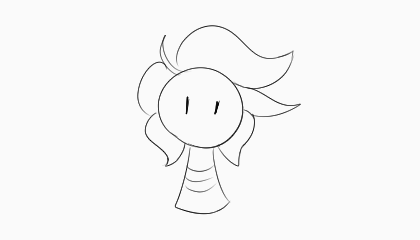

---
tags:
  - animated
  - solana
---

# Rendition 042 – Line Boil (2023-10-18)

## Overview

I had spare energy and attention Wednesday evening. To use these resources, I experimented with storyboarding tools. I've often seen storyboards and animatics for narrative purposes, so it is a medium I've wished to explore for personal purposes.

The image presented in this post is my first test animation in Clip Studio Paint and depicts a simple drawing of Solana with a
[line boil](https://tvtropes.org/pmwiki/pmwiki.php/Main/LineBoil) effect.

## Design notes

To provide an analogy, this animated image is to art software as a ["Hello, World!" program](https://en.wikipedia.org/wiki/%22Hello,_World!%22_program) is to programming languages—in other words, it is less the output that matters as much as the user's journey from zero experience to that output.

When I decided to experiment with storyboarding tools, I tried a few pieces of software before settling on the one that produced this animated image. For completeness, I have documented my experience with each piece of software, explaining what worked for me and what didn't.

- Adobe Photoshop CS6:
  - Pro: Has animation features naturally built in.
  - Pro: Has industry support.
  - Con: Seems superseded by Clip Studio Paint.
- [Storyboarder](https://wonderunit.com/storyboarder/):
  - Pro: Is highly optimized for storyboarding. Is fast and intuitive, especially for someone coming from Photoshop-like software.
  - Con: Seems poorly maintained. Zooming in and out was abrupt and erratic, and according to [the project's GitHub page](https://github.com/wonderunit/storyboarder/issues), a known issue.
- [Toon Boom Storyboard Pro](https://www.toonboom.com/products/storyboard-pro):
  - Pro: Has industry support.
  - Con: Has drastically different keyboard shortcuts from Photoshop-like software. Requires a learning curve.
- Clip Studio Paint:
  - Pro: Has animation features naturally built in.
  - Pro: Uses similar controls as Photoshop-like software.
  - Pro: Has industry support.
  - Con: Is not strictly for storyboarding. UI is somewhat suboptimal.
  - Con: Lacks support for subtitle tracks.

In contrast to drawings, I noticed how much animation must be planned up front. Before the artist can create a frame, the animation must be provided with a given aspect ratio, video resolution, and frame rate. Like what I found in [my previous art exercise](2023-10-13_rendition-041_screencap.md), planning out a piece up front produces a more cinematic result. Of course, I would need to draw a cinematic animation for that observation to be noticeable.
