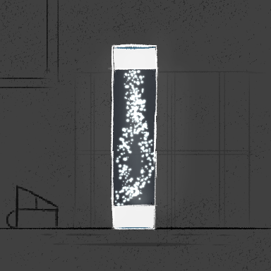

---
humorous:
  - lava lamp
tags:
  - arclight
---

# Rendition 043 – Arclight Flask (Posthumous) (2023-10-27)

## Overview

Recently, [sodiclo](https://twitter.com/sodiclo) posted [an illustration of theirs](https://cdn.discordapp.com/attachments/1009221988935532634/1167628203859386529/23-10-27_salt.png) on a shared Discord server. I was captivated by the art style used in the illustration, so I wanted to study it.

Quickly, though, I noticed a problem: I wanted to draw something to study, but I had no simple figures I could use. My characters—the primary figures I draw—are too complex for this purpose. Instead, I would need something with simpler shapes.

The shape that came to mind was the Arclight Flask. I had never drawn it before, so doing so sheds light on my universe. Furthermore, drawing the flask has a steep learning curve: its geometry makes it simple to draw, but the lighting effects within make it a challenge to render. This made it an excellent subject to revisit.

This image depicts the design of the Arclight Flask.

## Design notes

- Brushes used:
  - Real G-Pen, size = 6
  - Spray, size = 20, Particle size = 6.0, Particle density = 1
- Dall-E 3 prompt: Decorative cylindrical flask filled white, star-like motes (as a lighting fixture), vaguely reminiscent of a lava lamp and test tube.
- In retrospect, I could have drawn a pomegranate or another type of fruit; objects like these are simple enough to practice on while being meaningful in the context of my universe's narrative.

## WIPs

- [1](https://cdn.discordapp.com/attachments/1031694106717589544/1167650133496823855/image.png)
