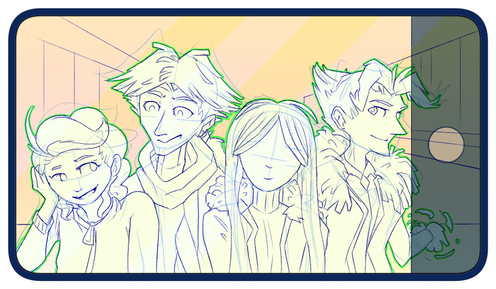

---
tags:
  - alis
  - solana
  - storyteller
  - vicerre
---

# Illustration 033 – Selfie 3 (2023-10-31 – 2023-11-02)

## Overview

Over the weekend of 2023-10-28 – 2023-10-29, I had the chance to rest. By doing so, I could concentrate on the following days. I looked at art tutorials I had previously gleaned over, then apply the information in those tutorials to my own work.

I was particularly motivated on 2023-10-31, so I attempted a composition with multiple characters. The character dynamics of my universe have shifted since the last time I drew a selfie, so an updated selfie seemed like an appropriate choice of image.

This image represents the final product of this exercise, featuring Team Arklight + a guest character on a bridge in Firenze.

## Design notes

- The art tutorial that held the most influence on this image was [[TUTORIAL] Why Your Drawings Don't Look Good](https://www.youtube.com/watch?v=Jjx9CUWMVx8). In the past, I've seen many tutorials vouch for separating sketch and lineart layers. However, I never applied this workflow, as I never understood why. This tutorial was the only one that convinced me of its benefits, explaining how separation of composition and lineart made for a cleaner final product. As a consequence, this image's composition came through more naturally—although it also came with a compromise to my art style.
- Alis is taking the selfie this time. This is in contrast to the [first](../2021/2021-11-27_illustration-004_selfie.md) and [second](../2023-q1/2023-01-12_illustration-014_selfie-2.md) selfies, where Solana and Vic took the selfie, respectively. This choice shows Alis's growth from a person reluctant to join to a person willing to help as a friend.
- I placed emphasis on the guest character, making sure perspective lines and lighting converged towards her. She is the guest of this scene, so it made sense to give her attention.
- When finalizing this image, I kept the lines I drew on the sketch layer. This gives the final lineart a sense of volume in the absence of shading.
- When drawing hair, I tapered the lines differently compared to those of other pieces. Instead of tapering lines at a point, I tapered them like rectangles. You can see this element most prominently in Vic's hair and Alis's fur lining compared to previous images. This was done to ensure my characters looked good in a style with more depth.

## Resources used

- [ponte vecchio](https://flickr.com/photos/careyon/19983977689/in/photolist-wrV7kt-orUAi1-4qXTju-NtqzW-cFcuQd-7o4x2g-mtWYUK-75URqL-6WM8YE-24TqPvm-2hPVirB-3VGenf-Vmw3GS-Ntqz1-txHYp-qnz7hn-2op5vep-mtYitY-2mftx7d-Pdpwjr-2ksTS64-mtWZLe-69mg96-6ubE17-u2A6cr-EMPRqJ-56qoQ-d3PtQE-M14JM8-2oAZzHt-6egdLM-LZf6YH-34DmZE-qhGf9o-2krBpht-2g1WsnQ-oneX5i-2kezhn5-mtV8wR-2p2NqXx-fv6RPn-HxsdYN-FFRWSy-2oihY6V-qtiAH3-2npcHgf-6ubuJb-zXjgqW-6trGMV-aB432J)

## WIPs

- [1](https://cdn.discordapp.com/attachments/1031694106717589544/1169044118727561290/image.png)
- [2](https://cdn.discordapp.com/attachments/1031694106717589544/1169065641936957470/image.png)
- [3](https://cdn.discordapp.com/attachments/1031694106717589544/1169780476345585794/image.png)
