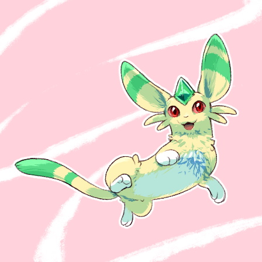

---
humorous:
  - generic anime mascot
  - we finally have a character with green in their palette
tags:
  - neko
---

# Illustration 034 – Carbuncle Design (2023-11-21 – 2023-11-22)

## Overview

I've always wanted to create a design for the carbuncles of my universe. Ever since [moscd](https://www.tumblr.com/moscd) told me he envisioned Neko as a Sprigatito, I could not see him as anything but. This interpretation could not stay.

After some iteration, I produced the image in this post. This image depicts one such interpretation of a carbuncle.

This design does not represent all carbuncles. Instead, it acts as one possible design carbuncles may take.

## Design notes

Compared to other mythological creatures, carbuncles are fairly ambiguous in design. Griffins, for instance, are beasts with the front half of an eagle and the back half of a lion. Kitsune are supernatural nine-tailed foxes. In contrast, carbuncles cannot be characterized so succinctly.

Traditionally, carbuncles are defined as small creatures with a mirror on their heads. However, this interpretation is inconsistent in pop culture. For example, carbuncles can be feliform or reptiliform. In addition, many interpretations of carbuncles replace said mirror with a gemstone, linking the carbuncle of mythology with the carbuncle of gemology.

The carbuncle's lack of definite design elements is both a pro and a con. As a pro, the design of a carbuncle can adapt to the needs of a setting. As a con, the lack of design elements places a creative burden on the designer.

It is due to this con that I've never designed the carbuncles of my universe. Since I've taken a break and returned refreshed, however, I am able to do so.

---

The design presented in the image provided takes cues from Neko, the resident carbuncle of my universe. Neko has the following properties:

- He can be carried in a backpack.
- He can purr.
- He can stand on a person's shoulders.
- He has a green gem on his head.
- He is not too exotic (in-universe).
- He is omnivorous.

In addition, I sought to satisfy the following design requirements:

- Carbuncles cannot resemble Espeon (from _Pokémon_) too closely.

After a number of design iterations, I produced the design depicted.

---

Brushes used:

- Real G-Pen

## WIPs

- [1](https://cdn.discordapp.com/attachments/1031694106717589544/1177038289006514286/image.png)
- [2](https://cdn.discordapp.com/attachments/1031694106717589544/1177075572678082640/image.png)
