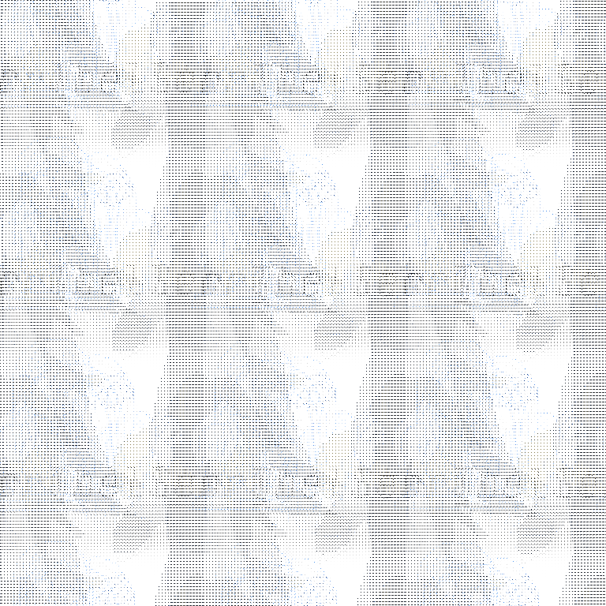

---
tags:
  - storyteller
---

# Illustration 035 – Character Sheet (2023-11-25 – 2023-11-26)

## Overview

[Since the Storyteller met with Alis on friendly terms](2023-10-14_vignette-060_the-visitor.md), I have a clearer idea of what they look like. As I could now draw the Storyteller, I have created a character sheet for them. The image in this post represents this character sheet.

## Design notes

- The Storyteller's design directly complements those of in-universe characters. You can see similarities between the Storyteller's outfit and those of existing characters. For instance, the turtleneck correlates to Vic, the fluffy hood correlates to Alis, and the shoes correlate to Solana.
- The Storyteller's design directly contrasts with those of in-universe characters. Whereas the other characters in my universe use a range of colors in their designs, the Storyteller uses a limited color palette in theirs.
- The Storyteller's art style does not mesh with those of in-universe characters. The Storyteller is not a traditional character, so they do not exist in a traditional sense. The lack of eyes, shading, and clean lines are intentional parts of the character's design.
- Earlier design: [1](https://cdn.discordapp.com/attachments/261586968230494219/1144806028777635900/image.png)
- Inspirations:
  - Spot (_Spider-Man: Across the Spider-Verse_)
  - Truth (_Fullmetal Alchemist: Brotherhood_)
- Title font: [JetBrains Mono](https://fonts.google.com/specimen/JetBrains+Mono)

## Resources used

- [BMP file format](https://en.wikipedia.org/wiki/BMP_file_format)
- [HexEd.it](https://hexed.it/)
- [vs. Lady BDSP](https://bulbapedia.bulbagarden.net/wiki/File:VSLady_BDSP.png)

## WIPs

(Omitted for encryption purposes.)
