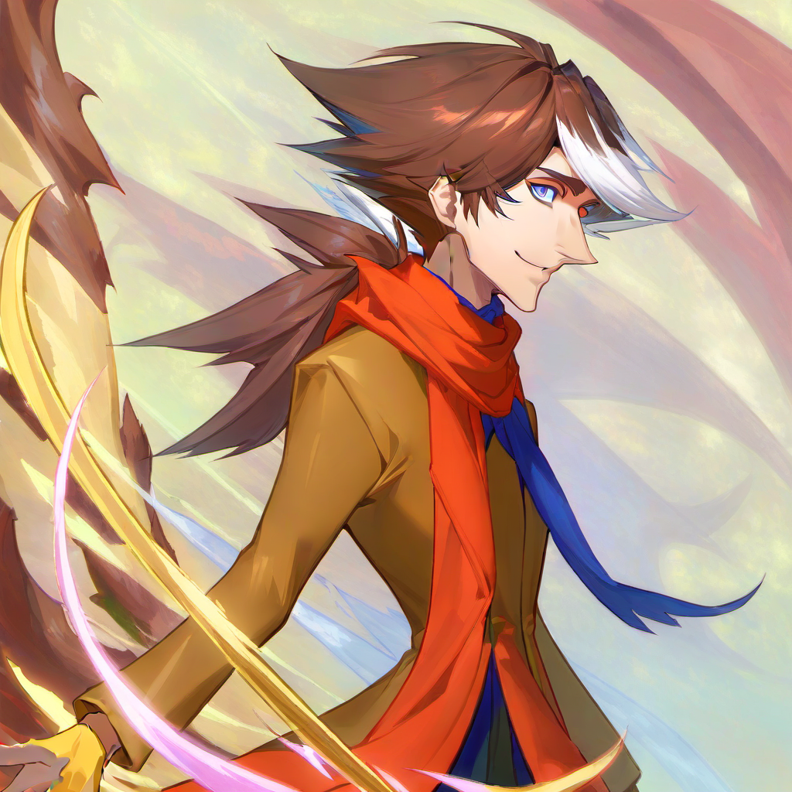

---
tags:
  - ai art
  - vicerre
---

# Meta 014 – Stable Diffusion LoRA Training



## Overview

The advent of Stable Diffusion has brought breakthroughs in affiliated technologies. One such technology is [Low-Rank Adaptation of Large Language Models](https://stable-diffusion-art.com/lora/), or LoRA for short.

LoRA allows Stable Diffusion users to inject custom training data into an existing model. This makes it easy to prompt a model with concepts it may not know, such as a specific subject or art style.

Fine-tuning a Stable Diffusion model is not new. Technologies such as [hypernetworks](https://stable-diffusion-art.com/hypernetwork/), [textual inversion](https://stable-diffusion-art.com/embedding/), and [Dreambooth](https://stable-diffusion-art.com/dreambooth/) solve the same use case. What makes LoRA different from other methods, however, is its ease of use. Whereas textual inversion and hypernetworks consume few resources to achieve a small effect, and Dreambooth consumes many resources to achieve a significant effect, LoRA consumes a moderate amount of resources to achieve a moderate effect.

Given the span of interests, I found LoRA to be a promising tool for creativity.

---

As always, there is a large gap between visual depictions of Vic and my mental image of him. Every drawing I make misses its mark, and every drawing other people make only makes the gap more apparent. Furthermore, I lack the visual acumen to understand how to bridge that gap.

Stable Diffusion, in this case, bridges said gap—if only slightly.

By training a LoRA model on Vic, I can prompt Stable Diffusion to render him in a variety of compositions. Through these results, I hope to understand the principles missing in his renders and, eventually, be able to draw them myself.

The image in this post depicts one image out of a large number of generations I was particularly fond of. Other generations I found interesting can be found [on Imgur](https://imgur.com/a/SD2OpYb).

<!--
The image evokes a faintly sinister aspect of Vic. This aspect is challenging to capture, as when drawing, it is easy for this aspect to devolve into classical villainy. Details such as the lazy eyelid, shading on the eyebrow, and shape of the eyebrow all contribute to this impression.
-->

## Observations

When using an image generation model, I study and take notes on the results for use in future human-made images. The observations made during this process are as follows:

- A well-known observation about AI-generated images is the principle of first impressions: AI-generated images often look impressive at a glance, only to deteriorate upon closer inspection. In contrast, I make images accurate first and impressive later. I shouldn't be afraid to bend the rules of anatomy and shading for the sake of better composition.
- Backgrounds make a world of difference in capturing the energy in an illustration. They cannot simply be, well, relegated to the background.
- As economic as it would be to manage a small number of layers and blend modes, I think I need to fully understand color theory to evoke the same coloring results as AI-generated illustrations.
- As I create visual media for recreational purposes, I often improvise rather than apply art principles methodically. Every time I study those underlying principles, however, I find I kick myself for not having practiced earlier. I should dedicate more time to exercise for the sake of exercise rather exercising for the sake of drawing my characters.

## Workflow – LoRA Training

- UI: [kohya_ss](https://github.com/bmaltais/kohya_ss)
- Test model: Stable Diffusion 1.5
  - Base model: [Anything V3](https://civitai.com/models/66/anything-v3)
  - Target model: [Counterfeit-V3.0](https://civitai.com/models/4468/counterfeit-v30)
- Final model: Stable Diffusion XL
  - Base model: [CounterfeitXL](https://civitai.com/models/118406/counterfeitxl)
  - Target model: [CounterfeitXL](https://civitai.com/models/118406/counterfeitxl)

## Workflow – Image Generation

- UI: [ComfyUI](https://github.com/comfyanonymous/ComfyUI)
- Positive prompt: `masterpiece, armin_vicerre, 3/4 view, 1boy, solo`
- Negative prompt: `nsfw, lowres, 1girl, (bad anatomy:1.21), bad hands, text, error, missing fingers, extra digit, fewer digits, cropped, worst quality, low quality, normal quality, jpeg artifacts, signature, watermark, username, blurry, artist name,`
- Steps: 20
- Sampler: DDIM
- CFG scale: 8
- Seed: 307307988959939
- Size: 1024x1024
- Denoising strength: 1.0

## Workflow – Inpainting

- UI: [AUTOMATIC1111](https://github.com/AUTOMATIC1111/stable-diffusion-webui)
- Model: CounterfeitXL
- Original image: ([1](assets/2023-12-07_image-117.png))
- Prompt:

```
masterpiece, 3/4 view, 1boy, solo
Negative prompt: nsfw, lowres, 1girl, (bad anatomy:1.21), bad hands, text, error, missing fingers, extra digit, fewer digits, cropped, worst quality, low quality, normal quality, jpeg artifacts, signature, watermark, username, blurry, artist name,
Steps: 20, Sampler: DDIM, CFG scale: 15, Seed: 3147777030, Size: 768x768, Model hash: b0006b2ccc, Denoising strength: 0.5, Mask blur: 4, Version: 1.6.1
```
