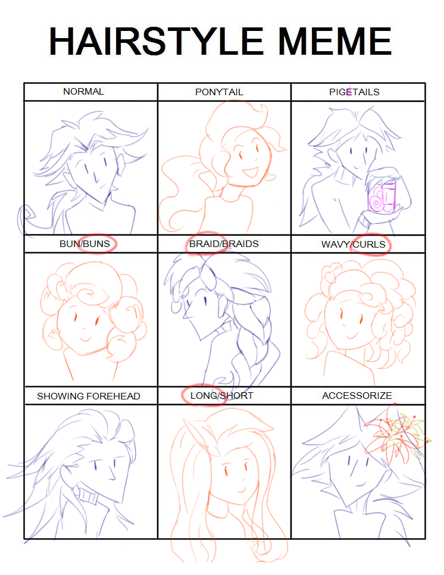

---
tags:
  - meme
  - solana
  - vicerre
---

# Rendition 045 – Hairstyle Meme (2023-12-20)

## Overview

On 2023-12-20, [YuIOTJ](https://www.tumblr.com/yuiotj) shared a hairstyle meme template on a Discord server I frequent. I was interested in completing it; given my universe's inspirations, hairstyles play an important role in character design.

This image depicts the result of completing the template. This image features sketches of Vic and Solana in various hairstyles.

## Design notes

- When determining what to draw, I thought about how I would depict certain characters for certain prompts. I wanted to draw Vic for the "pigetails" [sic] cell, and I wanted to draw both Vic and Solana for diversity, but I had no strong preference otherwise. In the end, I alternated between drawing Vic and Solana depending on the cell's parity.
- One major motivation I had for completing the meme template was in filling the "pigetails" [sic] cell. I wanted to draw Vic, and, Vic being Vic, he has to make the visual pun of holding literal pig tails.
- Braids are often associated with refined cultures. Given Vic's character archetype, I thought the braided hair I drew in the "braid" cell matched his design well.
- My inspiration for the "showing forehead" cell is Takuto Maruki from _Persona 5 Royal_. Maruki switches from ruffled hair to slicked-back hair in a fantastical setting. Given the character parallels between Maruki and Vic, I thought a slicked-back hairstyle was appropriate for Vic as well.
- When brainstorming about what to draw for the "accessorize" cell, I quickly decided to draw Vic with flowers. Vic specializes in perversions of nature, and Vic is familiar with a goldhorn, so flowers seemed like a natural fit. When identifying which flowers to depict:
  - My first choice of flower was the red spider lily. Red spider lilies are red, spindly, and, in Japanese media, associated with death. Vic enjoys the color red, is spindly, and finds death fascinating, so I found it fitting.
  - My second choice of flower was Zada's flower. [Considering Vic's past with Zada,](../2023-q3/2023-08-03_vignette-041_bloom.md) it was thematic to depict Vic with the same flower. I imagine Zada's flower to be a yellow version of the pink brilliant lily, so I have depicted it as such.
- When creating these sketches, I identified and then corrected a flaw in my drawing workflow: When drawing portraits, I usually drew the head, neck, and body (in that order). This led to stiff-looking portraits. For this exercise, I drew the head, body, and neck (in that order). This improved the flow of my portraits. [This tip is analogous to one I learned from LavenderTowne regarding drawing the hand, arm, and body.](https://youtube.com/watch?v=Fvx7nZsHqQ0)

## Resources used

- [thanks a million... views.. get it? cuz eyes... XD](https://web.archive.org/web/20150501091211/http://sigeel.deviantart.com/art/thanks-a-million-views-get-it-cuz-eyes-XD-489075802)
- Template: [link](https://web.archive.org/web/20150910062635/http://jesslicious-arts.deviantart.com/art/Hairstyle-Meme-181892402)
