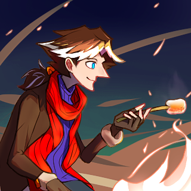

---
tags:
  - ai art
  - style study
  - vicerre
---

# Rendition 046 – Counterfeit-V3.0 Style Study (2023-12-23 – 2023-12-24)

## Overview

[Recently, I trained a Stable Diffusion LoRA model on Vic and studied the images generated.](2023-12-10_meta-014_stable-diffusion-lora.md)

Past initial usages, I wanted to work more with the LoRA. I've used the LoRA in isolation on an existing model (Counterfeit-V3.0), but now I wanted to use other compatible keywords and LoRA.

To do this, I generated thousands of images using Vic as a keyword alongside various narrative descriptions, types of media, and names of artists. From here, I compiled my favorite generations and studied them through a drawing of my own.

The image depicted in this post is the result of this study. Out of the images generated, I was particularly taken by one depicting Vic roasting a marshmallow over a campfire. Thus, I took this image and made my own hand-drawn version.

## Design notes

- I took a circuitous route to reach the prompt used for the image featured. The keywords I used roughly followed the following train of thought: [Macka](https://sunfished.neocities.org/ocs) (Sunfished's character) → trout → goldfish → shrimp ([fried rice meme](https://knowyourmeme.com/memes/youre-telling-me-a-shrimp-fried-this-rice)) -> ice cream (Vic's favorite dessert) -> marshmallows (a warm and toasty snack by contrast)
- I noticed the images selected as favorites satisfied one of several criteria. The criteria are as follows:
  1. The image was composed in a way that evoked an emotional response from me.
  2. The image created an interesting correlation between a given keyword and the generated result. For example, I found it delightful that Vic was generated in a [T-pose](https://en.m.wikipedia.org/wiki/T-pose) upon using the keyword "3D model".
  3. The image depicts Vic well in an alternate art style.
- Image generation numbers:
  - Total images generated: 7480
  - Images saved: 739
  - Images selected as favorites: 42
  - Images used to study: 6

## Observations

- I rely on implicit horizontal and vertical lines in my artwork. This leads to undesirable, static-looking compositions. Examples from this study include the following details:
  - When I tried to replicate the flame initially, I drew the flames flickering vertically. In comparison, the flames in the reference image look windswept.
  - I implicitly assumed the brow of Vic's hair runs parallel to the ground. Due to this, his head always looked level. In contrast, the generated image applies a tilt Vic's head.
- Counterfeit-V3.0 is more creative than logical in its use of multicolored outlines and shadows. In previous drawings, I had omitted these features due to a lack of rigorous method, but I reproduced these methods here.
- The quality of linework affects the level of realism associated with an image. [Previously, I learned](https://www.youtube.com/watch?v=tCgSRtDRR-8) how making lines thinner or removing them entirely makes an area look overexposed (and thus, more realistic). In this study, I was judicious in controlling the thickness of the linework.

## Resources used

- [`armin_vicerre roasting marshmallows over a campfire, 1boy, solo`](assets/2023-12-23_image-121.png)
- [2023-12-15 – 2023-12-23 – Counterfeit-V3.0 – Armin Vicerre](https://imgur.com/a/UOXYm4G)
- [Toasted Marshmallow – 11oz Candle](https://www.thecandlelabcincy.com/product/toasted-marshmallow-11oz-candle/)

## Workflow – Reference Image

- Positive prompt: `masterpiece, armin_vicerre roasting marshmallows over a campfire, 1boy, solo`
- Negative prompt: `nsfw, lowres, 1girl, 2boys, (bad anatomy:1.21), bad hands, text, error, missing fingers, extra digit, fewer digits, cropped, worst quality, low quality, normal quality, jpeg artifacts, signature, watermark, username, blurry, artist name`
- Steps: 20
- Sampler: DDIM
- CFG scale: 8
- Seed: 1039754981187645
- Size: 768x768
- Denoising strength: 1.0

## WIPs

- [1](https://cdn.discordapp.com/attachments/261586968230494219/1188336660203700315/image.png)
- [2](https://cdn.discordapp.com/attachments/1031694106717589544/1188629455040692374/image.png)
