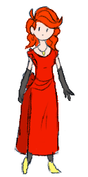
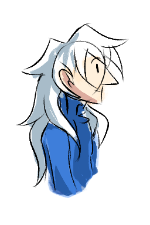
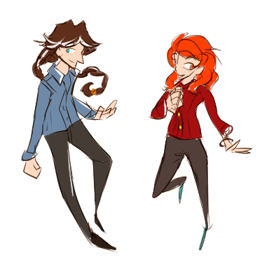
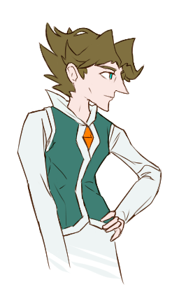

---
tags:
  - alis
  - costume design
  - solana
  - undyed
  - vicerre
---

# Illustration 036 – Solana in Red (2023-10-24)

# Illustration 037 – Vic with Undyed Hair (2023-12-05)

# Illustration 038 – Casual Outfits (2023-12-25)

# Illustration 039 – Coatless Alis (2023-12-26)

## Overview

[Previously, I discussed the character design philosophy of my universe](../2023-q3/2023-08-10_elucidation-032-033-034-035.md), which states my philosophy prioritizes visual storytelling over design. In summary, this means my characters are fairly simple to allow for greater flexibility.

Usually, I depict my characters in a consistent outfit. However, I do not want to bind them to this outfit. As a result, I have drawn my characters in variant designs, which are depicted in this post.

## Design notes

- I cannot see Solana dressed in any other color but red. This extends to formalwear. Thus, Solana is depicted in a long red dress in the first image.
- Since Alis restored Vic, Vic's hair has turned white. To look his age, Vic works with Solana to dye his hair. I hadn't drawn Vic with undyed and untied hair, so I drew him as such in the second image.
- As stated in the section above, I wanted to draw my characters in alternate outfits, so I drew Vic and Solana in more casual outfits in the third image.
- I wanted to draw Alis more in general, so I drew him in the fourth image.

In addition:

- [Ever since I drew Vic with braided hair for the Hairstyle Meme prompt](2023-12-21_rendition-045_hairstyle-meme.md), I've considered replacing Vic's ponytail with a braid. A long braid:
  - Stays clear of Vic's vision.
  - [Creates a line of action](https://tvtropes.org/pmwiki/pmwiki.php/Main/BraidsOfAction) (even when Vic isn't wearing a scarf).
  - Mirrors Vic's progression towards a more orderly lifestyle.
- Thus, the third image in this post depicts Vic in a braid.

## Resources used

- [1](https://twitter.com/washanapple/status/1579054314722856960)
- [Loose Hair Day](https://www.deviantart.com/scottgrisham/art/Loose-Hair-Day-831614371)

## WIPs

- [1](https://cdn.discordapp.com/attachments/1031694106717589544/1166560399613771807/image.png)
- [2](https://cdn.discordapp.com/attachments/1031694106717589544/1181768812341768202/image.png)
- [3](https://cdn.discordapp.com/attachments/1031694106717589544/1189060560998912010/image.png)
