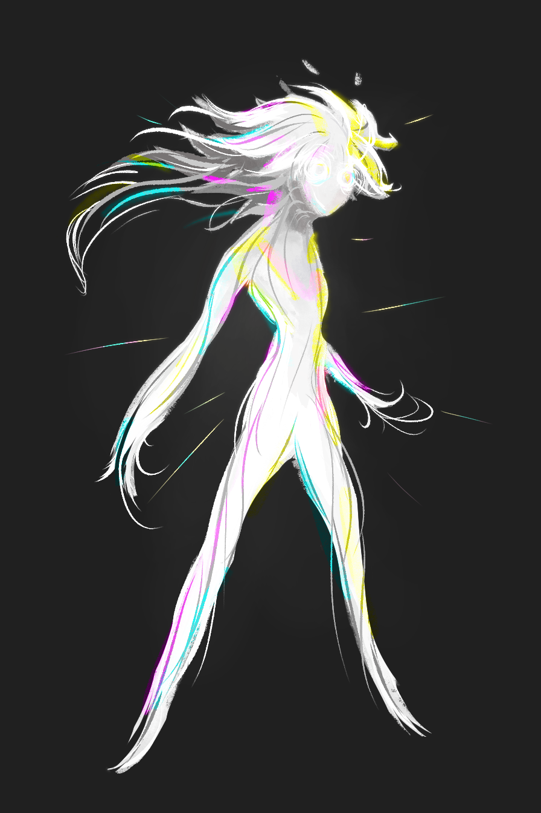

---
humorous:
  - prismatic
tags:
  - character design
  - oatmeal
---

# Illustration 040 – Aspect Design (2024-01-03)

## Overview

When I write characters, I use aspects of my personality as reference. One major aspect—and the one I entertain the most often—forms the foundation for Vic's personality. Among other traits, my lifelong curiosity, confidence, and grace are instilled in this aspect.

As I've developed my universe, it has become increasingly difficult to reconcile this aspect with the character it inspired (Vic); my universe has taken its own, independent life, so I could no longer associate my characters with my own identity.

As I could no longer reconcile the aspect with the character, I created a clear separation of identity between the two. From there, I was inspired to render my mental depiction of this aspect. The image presented in this post represents this depiction.

This image does not represent the canonical design for this aspect. Instead, it represents one design idea.

## Design notes

- As this aspect of my personality inspires Vic as a character, its visual design takes cues from Vic. Its body is humanoid, and its hair resembles Vic's hairstyle. In addition, the glowy, tendril-like shapes in the design come from a shelved idea where Vic were to ascend humanity.
- As this aspect does not represent a true character, this image does not follow my standard design philosophy. In contrast to the designs of my characters, this design is more abstract.
- Character inspirations:
  - Alphonse Elric (_Fullmetal Alchemist_)
  - Arceus (_Pokémon Diamond and Pearl_ beta)
  - Astral (_Yu-Gi-Oh! ZEXAL_)
  - Athena (_Hades_)
- Style inspirations:
  - [ego of a god](https://twitter.com/silly_chaotic/status/1616127327766974464)

## WIPs

- [1](https://cdn.discordapp.com/attachments/261586968230494219/1192282659506897008/image.png)
