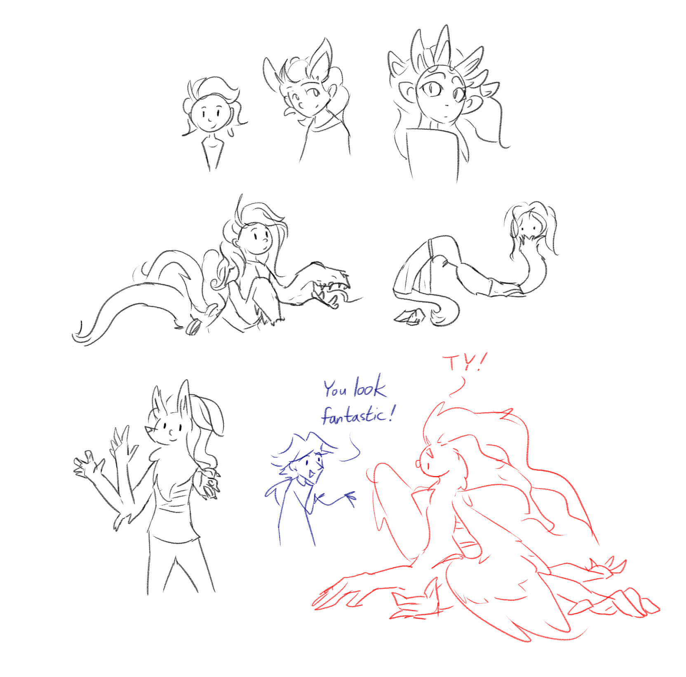

---
tags:
  - polymorph
  - solana
---

# Illustration 041 – Solana Morphs (2024-01-29)

## Overview

Following Vic's procedures, Solana gained the ability to morph parts of her body into the shapes of other creatures. This ability allows her to take advantage of her connections to nature and to express the weirder parts of herself.

## Design notes

Inspirations:

- Alex Wesker (_Resident Evil: Revelations 2_)
- CounterfeitXL failed generations (Stable Diffusion XL model)
- Envy (_Fullmetal Alchemist: Brotherhood_)
- Malachite (_Steven Universe_)
- Mia (_Death Vigil_)

<!--
https://www.reddit.com/comments/17jt8rj/
-->
