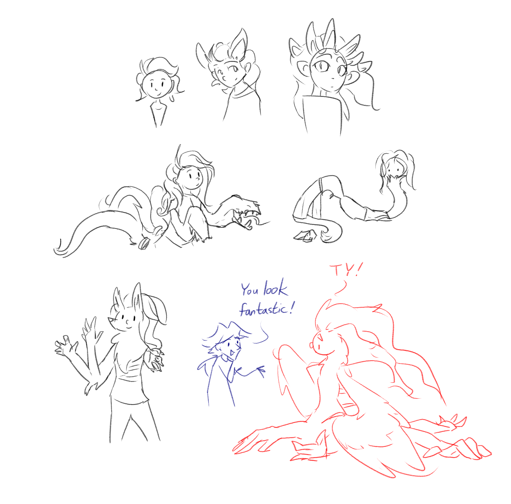

---
tags:
  - polymorph
  - solana
---

# Illustration 046 – Solana Morphs (2024-01-29)

## Overview

Following Vic's procedures, Solana gained the ability to morph parts of her body into the shapes of other creatures. This ability allows her to take advantage of her connections to nature and to express the weirder parts of herself.

So far, Solana and Vic have determined the ability respects the following mechanics:

- Solana can morph into any creature she has reincarnated from. Effectively, she can morph into human, kitsune, and owl-fox gryphon forms.
- Solana can only morph into female versions of these forms.
- Solana retains full sentience between forms.
- The size of her forms does not need to match the size of the original forms. She can adjust the scale to be any value practical under standard physics.
- Mass is not conserved between forms. Extra mass is spliced in and out of Solana's dimension as needed.
- Solana needs to concentrate to morph her body. Any disruption will leave her in a half-morphed state. Retaining the final shape, however, does not require concentration.
- It takes roughly two seconds to morph a human-sized unit of mass.

## Design notes

Inspirations:

- Alex Wesker (_Resident Evil: Revelations 2_)
- CounterfeitXL failed generations (Stable Diffusion XL model)
- Envy (_Fullmetal Alchemist: Brotherhood_)
- Malachite (_Steven Universe_)
- Mia (_Death Vigil_)

<!--
https://www.reddit.com/17jt8rj/
-->
