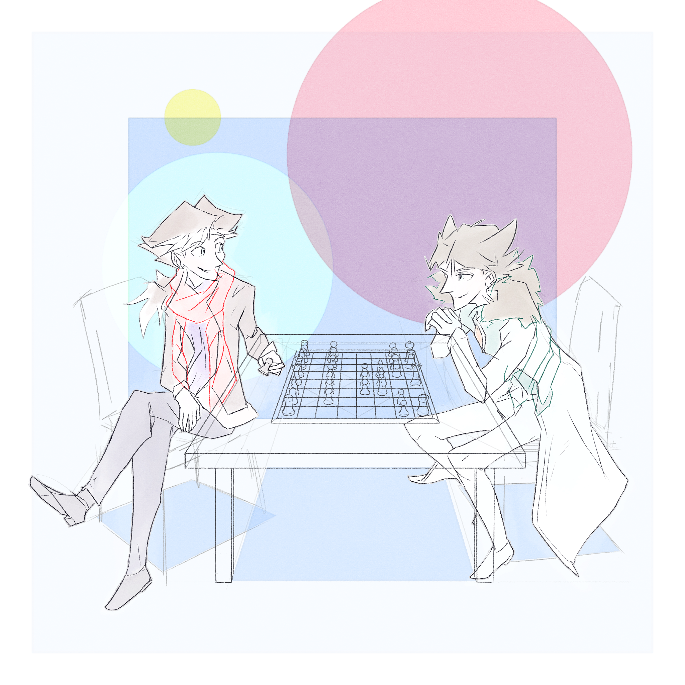

---
humorous:
  - 'Clearly, the plural of "octopus" is "octopon".'
  - I will never draw actual chairs, will I?
  - '"By the way, Alis, the displacement portholes were a great idea. Solana loves them."'
tags:
  - alis
  - chess
  - vicerre
---

# Illustration 042 – A Friendly Game of Chess (2024-01-15, 2024-01-21, 2024-02-02 – 2024-02-03)

> "Armin, really, what _are_ you doing with your opening position?"
>
> "What, you're telling me you've never seen the Octo-Pawn Offense before, Alis?"

## Overview

n/a

## Design notes

- I produced this drawing with a simple goal in mind: I wanted to draw Alis and Vic together. As Alis and Vic are defined through comparison and contrast, I wanted my composition to reflect these traits. After several composition attempts, I settled on depicting the two of them engaged in a friendly game of chess, depicting how each sits and plays.
- Initially, I did not intend to use proper perspective when composing this piece; constructing perspective lines took effort, so I resisted incorporating them. As I worked, however, I found the use of proper perspective highly effective in improving the quality of the piece.
- In using proper perspective, I discovered one tip: to draw a figure in 3D space, it helps first to identify the plane on which the figure lies. This ensures the figure is drawn relative to a known, fixed point. (This realization is in parts an extension of [EmilioDekure's tip on drawing legs in space](https://twitter.com/UDekure/status/1507085634392899584).)

  In this piece, the reference planes for the chairs proved to be key in drawing Alis and Vic in the same plane. As a bonus, these reference planes doubled as drop shadows.

- Midway through drawing, I decided I would not have the attention span to illustrate this image with a full set of colors and shading. Instead, I turned to a simpler, more stylistic approach. As I already placed rectangles in this piece, I added more geometric shapes. In the end, I produced a result reminiscent of 1960s modern art.
- Brushes used:
  - Lineart: Pencil > Mechanical pencil
  - Colors: India ink > Watery ink
  - Colors: Blend > Wet bleed blender

## Resources used

- [A Student of Corbu's in Nutley](https://www.curbed.com/article/new-jersey-home-le-corbusier-student-tour.html)
- How to BURST the Worst (Openings)! ([HTML](https://www.uschess.org/index.php/October/How-to-BURST-the-Worst-Openings.html), [PDF](https://uscf1-nyc1.aodhosting.com/CLK-ALL/2008/2008.10.pdf))
- [Kyle's Very Nice Paper Layer](https://kyletwebster.gumroad.com/l/ZHvXw)
- [Mann Indigo Blue Dining Chair](https://www.article.com/pla/18289/manna-indigo-blue-dining-chair)
- [Photo by Vlad Sargu on Unsplash](https://www.pinterest.com/pin/737957088966405920/)

<!--
Chess Live Kids – October 2008 – Page 12
Pete Tamburro–Mike Wojcio
-->

## WIPs

- [1](https://cdn.discordapp.com/attachments/1031694106717589544/1198798527346782218/image.png)
- [2](https://cdn.discordapp.com/attachments/1031694106717589544/1203163277962518528/image.png)
- [3](https://cdn.discordapp.com/attachments/1031694106717589544/1203490386912215141/image.png)
