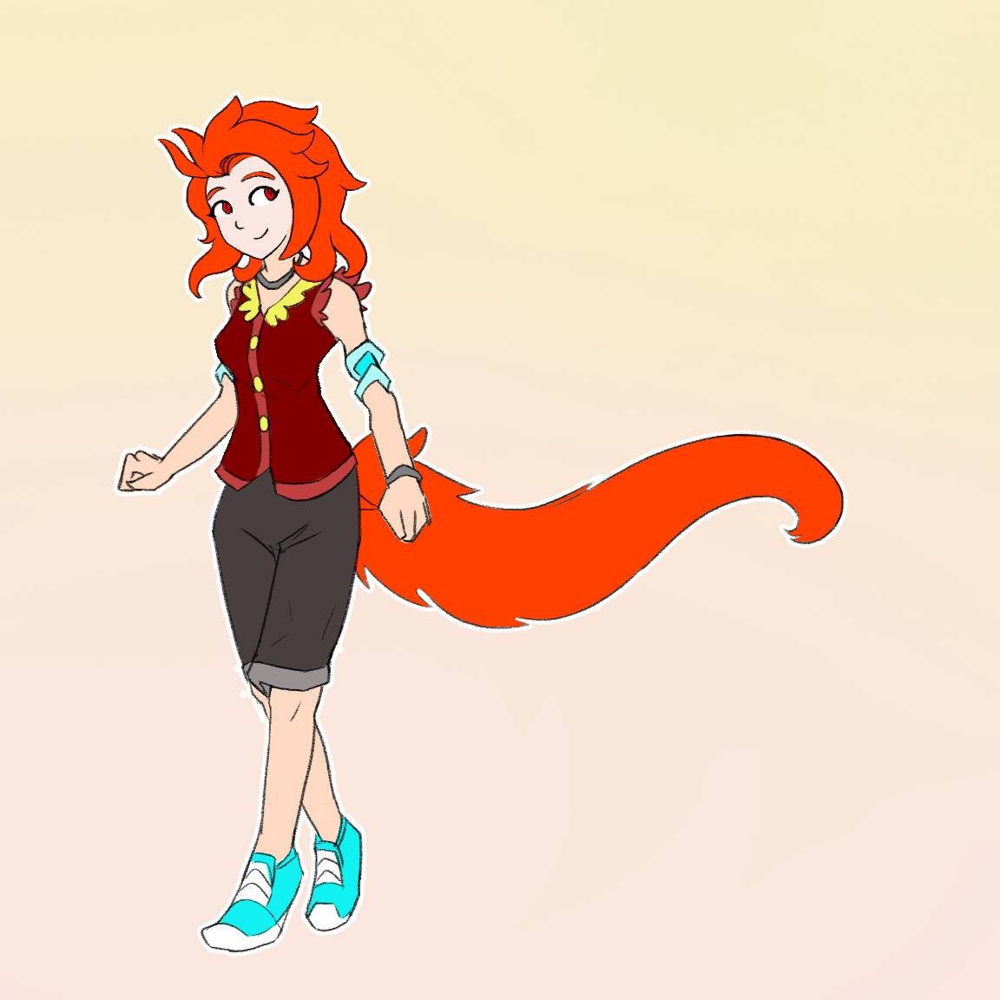

---
humorous:
  - arm-ins
tags:
  - character design
  - solana
---

# Illustration 043 – Solana Character Design Sketch (2024-02-08 – 2024-02-09)

## Overview

Recently, Solana experienced character growth. In doing so, her existing character design became stale, as it increasingly diverged from her current personality. Because of this, I sketched out an updated design for her, which I have presented in this post.

## Design notes

- This iteration of Solana's design was derived from the following principles:
  - Her character design should respect traditional character design principles.
  - In addition to being cute, she should also look attractive.
  - Her design should reflect her new polymorphic abilities.
  - Her design should include practical means of using her polymorphic abilities.
- Solana's character strikes a balance between reflecting her personality and being practical. She is designed to appear more professional while keeping a casual, sporty appearance. In addition, her design should allow her to retain flexibility in using her polymorphic abilities.
- The rings on Solana's body are displacement portholes, gifted to her by Vic. These portholes allow Solana to flaunt a big, fluffy tail while avoiding the need to tailor her clothes for an extra body part.
  - These portholes can be disrupted and fail. The effect is like that of ripping out an earring–it is painful, but any lasting damage can be treated.
- Solana's tail is retractable.
  - Personally, I'm not the most fond of including a fluffy fox tail. It's kept more out of a sense of obligation for character design principles than for practical purposes.

Inspirations:

- Holo (_Spice and Wolf_)
- Miss Fortune (_Skullgirls_)
- Squirrel Girl (Marvel Comics)

## WIPs

- [1](https://cdn.discordapp.com/attachments/1031694106717589544/1205346570875441192/image.png)
- [2](https://cdn.discordapp.com/attachments/1031694106717589544/1205690061216157696/image.png)
- [3](https://cdn.discordapp.com/attachments/1031694106717589544/1205720038766547024/image.png)
- [4](https://cdn.discordapp.com/attachments/1031694106717589544/1205897506601439232/image.png)
