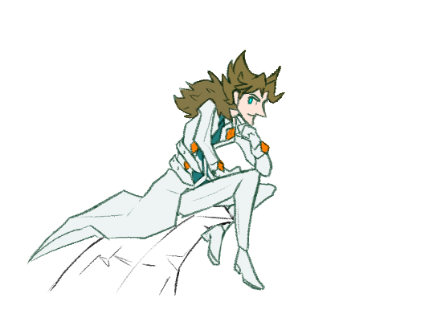

---
tags:
  - alis
---

# Illustration 045 – Alis (2024-03-01)

## Overview

I wanted to create more art for Alis, so I drew him perched on a precipice.

## Resources used

- [1](assets/2023-12-22_image-125.png)
- [Counterfeit-V3.0](https://civitai.com/models/4468/counterfeit-v30)

## Workflow – Reference Image

- Positive prompt: `masterpiece, armin_vicerre,(aaron horkey: 1.0), 1boy, solo`
- Negative prompt: `nsfw, lowres, 1girl, 2boys, (bad anatomy:1.21), bad hands, text, error, missing fingers, extra digit, fewer digits, cropped, worst quality, low quality, normal quality, jpeg artifacts, signature, watermark, username, blurry, artist name`
- Steps: 20
- Sampler: DDIM
- CFG scale: 8.0
- Seed: 937532382725591
- Size: 768x768

## WIPs

- [1](https://cdn.discordapp.com/attachments/1208868988851847168/1213333025891291186/image.png)
