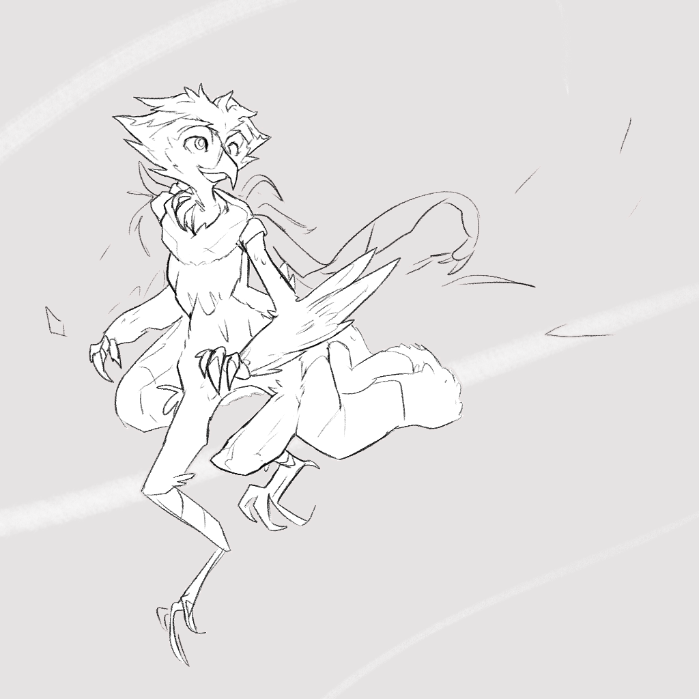

---
tags:
  - character design
  - vicerre
---

# Rendition 049 – Owl Vic (2024-03-11 – 2024-03-12)

## Overview

I was playing with Pony Diffusion XL when I generated some images of Vic as an owl-person. I thought the generations suited Vic very well, so I was inspired to draw him as one myself. The image in this post depicts Vic as an owl-person.

## Design notes

[In a past post, I deliberated over what animal motif fits Vic the best.](../2023-q2/2023-04-08_elucidation-018_animal-motifs.md) In it, I concluded I could not associate Vic with any singular species of animal.

Since then, my characters have evolved—Vic among them. Because of these changes, I've been able to more easily assign an animal motif to Vic—namely, the owl (the _Strigidae_ family in particular).

The reasoning for owls as a motif is as follows:

- Vic's character design matches those of owls:
  - Owls are associated both with knowledge and a lack thereof, matching Vic's intelligence but lack of social grace.
  - Owls are associated with the ominous, matching Vic's sinister aspects.
  - Owls have unusual features among birds, matching how Vic is fairly unusual among humans.
- Vic's visual design matches those of birds:
  - The tufts of hair on his head resemble fanned-out feathers.
  - His pointy nose resembles a bird's beak.
  - His lanky physique matches birds' anatomy (in particular, the legs).
  - The distribution of colors in his palette (brown primary, blue secondary, red tertiary) matches those of owls.
- Furthermore, Vic matches birds better than mammals, as birds are familiar, warm-blooded creatures, yet they in a class of their own.

## Resources used

- [2024-03-08 – 2024-03-11 – Pony Diffusion XL – Armin Vicerre – Owls](https://imgur.com/a/zudJ6V1)

## WIPs

- [1](https://media.discordapp.net/attachments/1208868988851847168/1216908200431845486/image.png)
