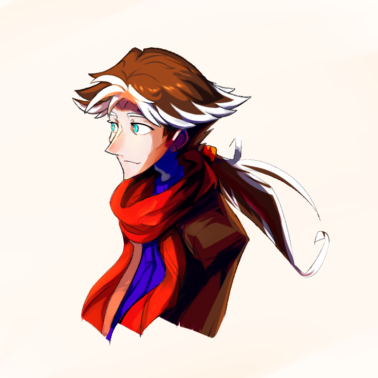

---
humorous:
  - '"I fear not the man who has drawn 10,000 characters once, but I fear the man who has drawn 1 character 10,000 times."'
  - 2024-03-12 was fantastic.
  - My mental model of Vic finally refreshed to his modern design.
  - American Revolution
tags:
  - vicerre
---

# Rendition 050 – Shading Exercise (2024-03-13)

## Overview

Over the past months, I've been playing with Stable Diffusion. It is a tool that can generate aesthetically- and compositionally-pleasing images, so I find value in it in studying aesthetics and composition.

Following these studies, I decided to produce a visual checkpoint of my art capabilities. To do so, I drew a vanilla Vic. Usually, I experiment with an art fundamental when I draw, but I refrained from doing so this time. Instead, I focused on rendering.

I could not keep myself from trying something new, however. Since I last held my stylus, I had acquired a new brush to use in Clip Studio Paint. When I shaded in my piece, I chose to try it out. As a result, the output of this drawing looks softer and more natural, which I think looks pretty.

## Design notes

Brushes used:

- Pen > Pen > 主線も水彩も厚塗りも一本でやる怠けものブラシ
- Pencil > Pencil > Mechanical Pencil

Resources used:

- [A Quick Crash Course on The 2 Best Brushes in Digital Art](https://m.youtube.com/watch?v=gn4ElwBVqnU)
- [How to Find the Best Brushes in Clip Studio (that Japanese artists use) + What I Use](https://m.youtube.com/watch?v=vsgxJURCtt0)

## WIPs

- [1](https://cdn.discordapp.com/attachments/1208868988851847168/1217684107211833355/image.png)
