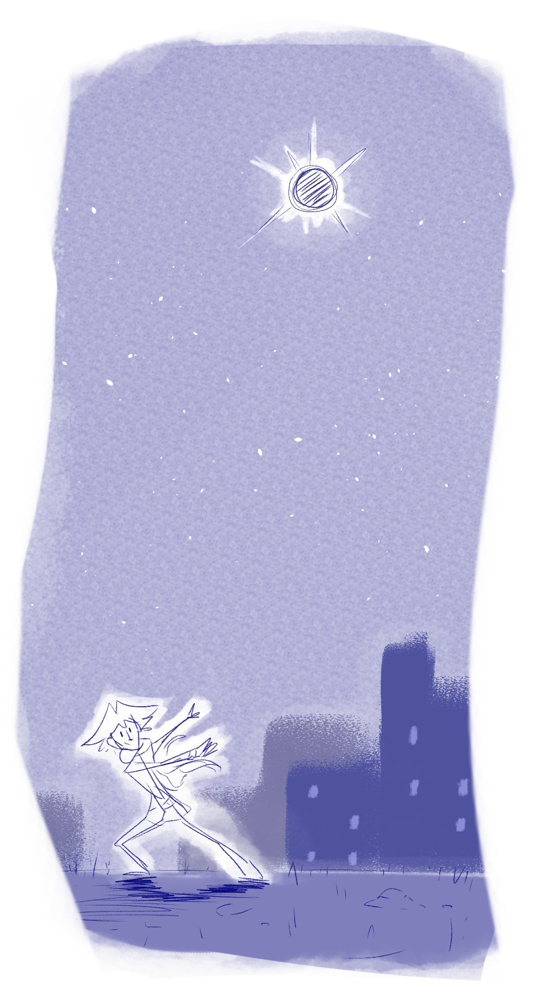

---
humorous:
  - _Find the Constellations_ by H. A. Rey
  - _The Reader's Digest Children's Atlas of the Universe_
tags:
  - vicerre
---

# Illustration 046 – Eclipse (2024-03-19)

## Overview

[non-canon]

When I was a child, I loved astronomy. It was the science of these celestial bodies that lay beyond our planet–ones that were beautiful and marvelous to observe. In particular, constellations inspired me; during my spare time, I loved to draw stars on a sheet of paper and create images by connecting the dots.

As I grew older, my attention turned to more practical learnings. Substitute astronomy with computer science, and you've formed the basis of my professional career.

The child in me is not lost, however. The date 2024-04-08 is on the horizon, the day a total solar eclipse will be visible in North American. As a child, I read about the eclipse and was excited that one day, decades later, I'd have the perfect vantage point to see it. As the year impended, that childhood passion rekindled, and I made my plans to see the eclipse.

It is this childhood passion that, in part, forms the catalyst of Vic's character. [Given his own enthusiasm for astronomy](../2022-h2/2022-11-07_vignette-006_stargazing.md), Vic would be as enthusiastic about seeing an upcoming solar eclipse as I would be.

Therein lies the motivation for this sketch, which depicts Vic as having found the perfect solar eclipse vantage point to share with friends.

## WIPs

- [1](https://cdn.discordapp.com/attachments/1208868988851847168/1219828125123346492/tmp4.png)
