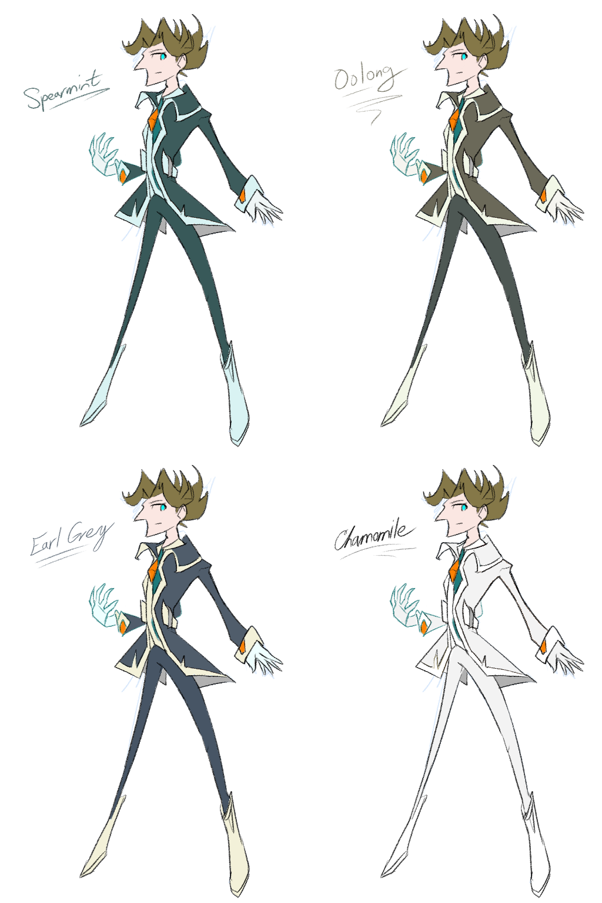

---
humorous:
  - sophomoric bastard
  - thin mint
tags:
  - alis
  - palette swap
---

# Illustration 047 – Alis Color Palettes (2024-03-21)

## Overview

Following [Illustration 046](2024-03-19_illustration-046_eclipse.md), I wanted to draw a companion piece featuring Alis in Firenze. In doing so, however, I realized I wanted to draw him in a less wintry outfit, one which I had not yet designed. Thus, I took a detour to draw such an outfit.

While I was able to create the shape of this outfit, I could not assign it a palette. I had created multiple potential palettes, but I could not point to a single palette that matched Alis best. Thus, I left the choice of palette indeterminate. As such, each of these palettes are presented in this post.

## Design notes

Reasoning for each palette:

- Spearmint: This palette places emphasis on pine green, Alis's core theme color. Additionally, this color alludes to the "spearmint" puzzle in _Shaved Ice_.
- Oolong: This palette borrows the earthy brown tones in Vic's classic design, augmented by Alis's signature green tint to create his own identity.
- Earl Grey: This palette complements Vic's design by placing an emphasis on muted, cool colors. Furthermore, it incorporates a subtle yellow trim to mirror Alis's proud personality.
- Chamomile: This palette copies Alis's post-manifestation outfit and thus inherits the same symbolism. This palette makes heavy use of the color white, the color of purity, dogma, and winter, and all elements associated with Alis.

In addition, the pine green waistcoat and orange diamonds were fixed aspects of the design regardless of palette.

## WIPs

- [1](https://cdn.discordapp.com/attachments/1020875112045613217/1220885752431251496/image.png)
