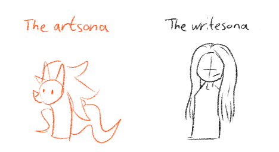

---
humorous:
  - ob-verse
  - re-verse
tags:
  - alis
  - illustrator
  - oatmeal
  - solana
  - storyteller
  - vicerre
---

# Elucidation 043 – Vicerre and Twinning

Alis and Vic are two sides of the same coin. Despite their contrasting personalities, they share the same types of thought processes. It is to the extent where, after a recalibration period, they could seamlessly swap roles with each other.

- Alis chooses to diverge from Vic because he's vicariously happy for him, seeing no need to continue along the same path.
- Vic is grateful for Alis as himself in the same way one might be glad to see someone apply their prior experiences and create something new from them.

# Elucidation 044 – Vic's Subversiveness

While he still gets the itch, Vic doesn't perform as many rule-bending antics since he and the Storyteller reconciled. It turns out that you're more inclined to follow the natural order of things when you discover things are working out for you. In that sense, Vic has taken more of a [Trickster Mentor](https://tvtropes.org/pmwiki/pmwiki.php/Main/TricksterMentor)-like role (or simply a mentor-like role) for his fellow company.

# Elucidation 045 – Vic and the Word "Intelligence"

Vic is as uncomfortable with the word "intelligence" [as he the word "love"](../2023-q4/2023-12-18_icebreaker-099-100-101.md). He enjoys science and puzzles–pursuits that could be considered intellectual. However, he avoids referring to these interests as "intellectual", as the word explains nothing and only serves to intimidate.

On the other hand, he most certainly accepts he [intellectualizes](https://en.wikipedia.org/wiki/Intellectualization) thoughts he finds disruptive.

# Elucidation 046 – Meta-Level Characters

Throughout its development, I've cultivated a small collection of characters that interact with but exist outside my universe. I refer to these characters as "meta-level characters". Broadly speaking, they represent aspects of my personality, more directly so than non-meta characters.

The meta-level characters I have to date include:

- The Aspect (a sort of superego figure)
- The Illustrator (has id elements)
- The Storyteller (is very reserved, has a dry, witty side)

## Bonus sketch (2024-04-12)

# Elucidation 047 – Solana's Deviance and Vic

Vic is aware of Solana's deviant aspects; he has access to her aethernet history, after all. Besides, he's commingled with some of her past lives.
