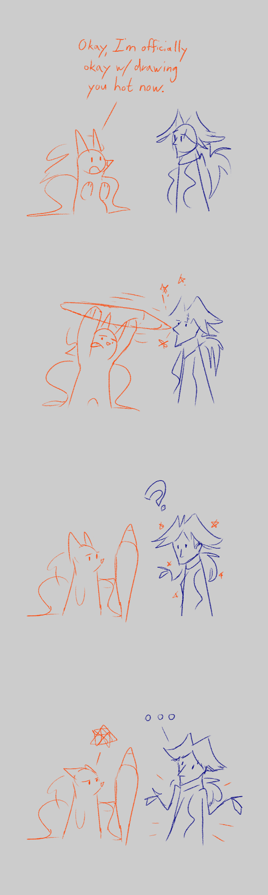

---
tags:
  - comic
  - illustrator
  - vicerre
---

# Doodle 007 – Attempted Fanservice (2024-04-13)

> Sometimes, characters have too much design inertia.

## Overview

Recently, I've had the time and energy to continue developing my visual skills. During then, I studied the following books:

- _The Lexicon of Comicana_ by Mort Walker
- _Making Comics_ by Scott McCloud
- _Perspective! For Comic Book Artists_ by David Chelsea

Following this study and recent happenings in my universe, I was inspired to draw a simple comic detailing my experiences drawing Vic.
