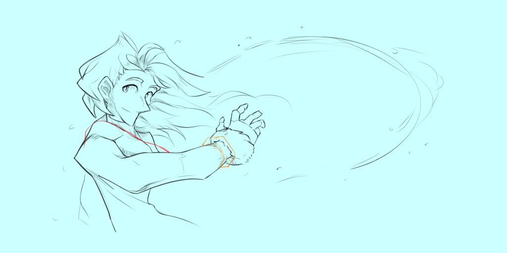

---
humorous:
  - Long-Haired Pretty Boy
  - Oh no, he's hot.
  - shaggy
  - scooby-doo
tags:
  - illustrator
  - solana
  - sketch
  - vicerre
---

# Rendition 051 – Undone Hair (2024-04-25)

## Overview

In [Doodle 007](2024-04-26_doodle-007_attempted-fanservice.md), I expressed my interest in drawing Vic in a more attractive light. While the comic was drawn for humor, it reveals a latent goal in Vic's design development: the level of traditional attractiveness I am willing to draw Vic in corresponds with his confidence and my detachment from him.

Thus, when I was passing the time on 2024-04-25 and my fingers started to move, I ended up sketching Vic with his hair undone.

## Design notes

- Vic carries his hair tie on his right wrist. This mirrors Solana, who carries a hair tie on her left wrist.
- While unintended, I enjoy the symbolism of Vic carrying an orange token with him. Like how Vic keeps a red token as a memento from Solana, he might also carry an orange token as a memento from the Illustrator.

## Bonus sketch

