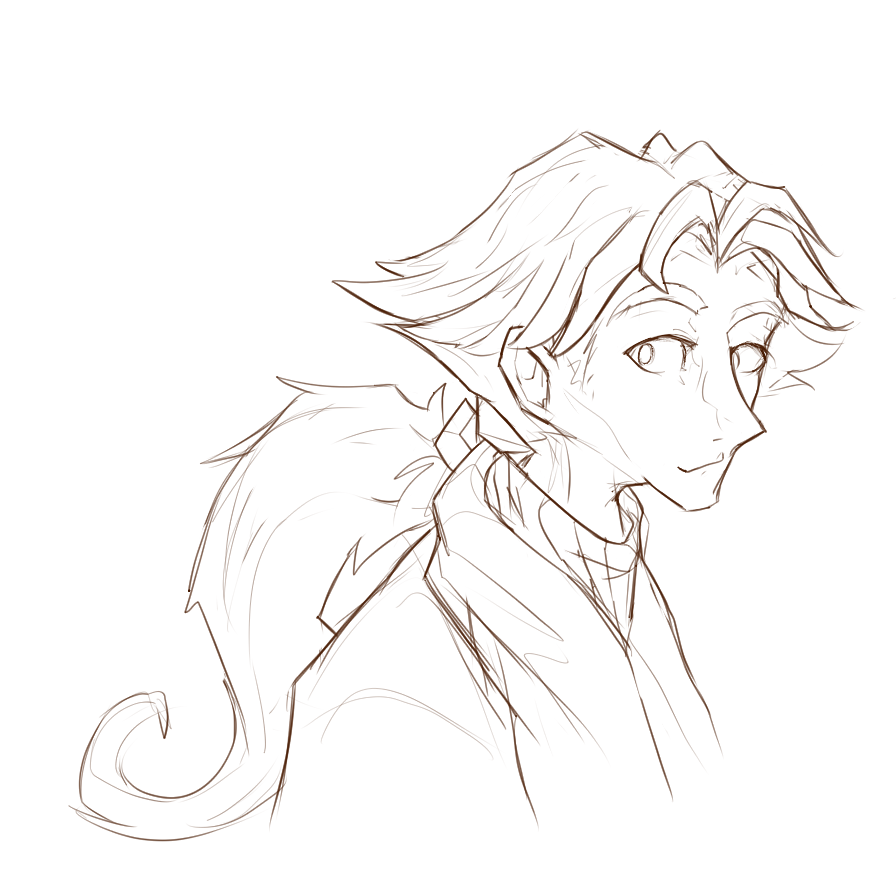

---
humorous:
  - One of these days, I'll draw a high-definition portrait of Vic I'm satisfied with.
  - But today is not that day.
tags:
  - portrait
  - sketch
  - vicerre
---

# Rendition 052 – Vicerre Portrait (2024-05-03)

## Overview

I was inspired to draw character design archetypes I'm fond of. During this process, I tried drawing a portrait of a character archetype adjacent to Vic's. Naturally, this drawing ended up becoming a portrait of Vic.

## Design notes

Compared to other sketches, I took a more technical approach to drawing the human figure. Instead of freehanding the proportions, I blocked in the shape of the skull and added detail from there. As a result, the drawing retains realism and detail, qualities associated with high-quality images.
