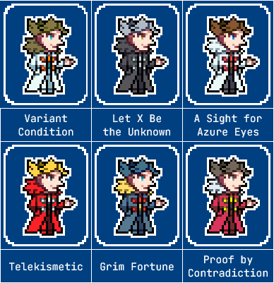

---
humorous:
  - Sissel = Vash the Stampede
tags:
  - alis
  - palette swap
  - pixel art
---

# Rendition 054 – Fighting Game Palettes (2024-05-08)

## Overview

A collection of palette swaps for Alis. These palette swaps accompany those of Solana([1](../2023-q3/2023-07-05_rendition-038_fighting-game-palettes.md)) and Vic([1](../2022-h2/2022-10-12_rendition-025_fighting-game-palettes.md), [2](../2023-q1/2023-02-12_rendition-030_fighting-game-palettes.md)).

These palettes take inspiration from characters with similar tropes to Alis, which I will explain below.

## Explanation

| Name                   | Reference                               | Name Inspiration                                                                                                                                                                                 | Similar Tropes                                                                                                                                 | References Used                                                                                         |
| ---------------------- | --------------------------------------- | ------------------------------------------------------------------------------------------------------------------------------------------------------------------------------------------------ | ---------------------------------------------------------------------------------------------------------------------------------------------- | ------------------------------------------------------------------------------------------------------- |
| Variant Condition      | (default)                               | Counterpart to ["Control Condition"](../2022-h2/2022-10-12_rendition-025_fighting-game-palettes.md) and ["Experiment Condition"](../2023-q1/2023-02-12_rendition-030_fighting-game-palettes.md). |
| Let X be the Unknown   | Xemnas (_Kingdom Hearts_ series)        | Organization XIII naming + "The Unknown" title.                                                                                                                                                  | grandiosity, hairstyle, longcoat, manipulativeness                                                                                             |
| A Sight for Azure Eyes | Seto Kaiba (_Yu-Gi-Oh!_)                | "Blue-Eyes", his YGO card archetype + ["a sight for sore eyes"](https://en.wiktionary.org/wiki/sight_for_sore_eyes)                                                                              | pride, (white) longcoat                                                                                                                        | [1](https://yugipedia.com/wiki/Seto_Kaiba#/media/File:SetoKaiba-DULI.png)                               |
| Telekismetic           | Sissel (_Ghost Trick_)                  | "Telekinetic" + ["kismetic"](https://en.wiktionary.org/wiki/kismetic) (referring to Temsik Park).                                                                                                | byronic, doppelgänger, manipulation, sympathetic antagonist                                                                                    | [1](https://ghost-trick.fandom.com/wiki/Yomiel/Image_Gallery?file=Yomiel.png#Promotional_Artwork)       |
| Grim Fortune           | Grimsley (_Pokémon Black and White_)    | Name + theme.                                                                                                                                                                                    | eye color, facial expression, hairstyle                                                                                                        | [1](https://bulbapedia.bulbagarden.net/wiki/File:Black_White_Grimsley.png)                              |
| Proof by Contradiction | Miles Edgeworth (_Ace Attorney_ series) | Gameplay mechanic.                                                                                                                                                                               | [Heterosexual Life Partners](https://tvtropes.org/pmwiki/pmwiki.php/Main/HeterosexualLifePartners), logician, pride, sophistication, stiffness | [1](https://aceattorney.fandom.com/wiki/Miles_Edgeworth_-_Image_Gallery?file=Miles_Edgeworth-AASoJ.png) |

## Scrapped ideas

- Darkrai (_Pokémon: The Rise of Darkrai_): This character is dark yet sympathetic like Alis, but he is too action-oriented.
- Dottore (_Genshin Impact_): This character fulfills a similar narrative role to Alis, but he is too flagrantly villainous.
- Mordecai Heller (_Lackadaisy_): This character is deadly, serious, and sympathetic like Alis, but his palette wasn't unique enough to include.
- Solomon Lane (_Mission Impossible: Rogue Nation_): This character has a manipulative and sinister nature like Alis, but he is too obscure.

## Design notes

- Font: JetBrains Mono
- Background color: #1d2d4e
- The naming convention used for Alis's titles resembles the naming convention used for Vic's, as both sets of titles rely on clever wordplay. In contrast to Vic's titles, though, Alis's titles use logical terms.

## Resources used

- [1](https://www.pinterest.com/pin/1055249756421022123/)

## WIPs

- [1](https://cdn.discordapp.com/attachments/1208868988851847168/1237757062172115136/image.png)
