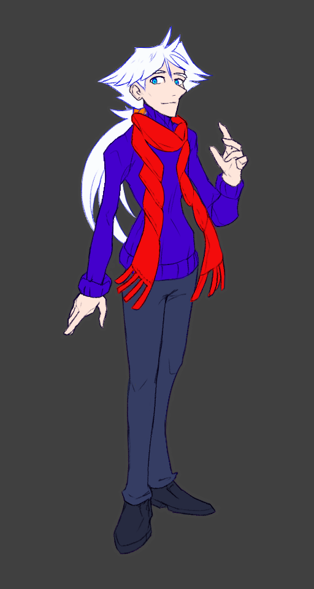

---
humorous:
  - Otherworldly and Chronologically Ambiguous
  - frosted tips
tags:
  - black coat
  - undyed
  - vicerre
---

# Rendition 055 – White Hair Design (2024-05-13)

## Overview

Vic's natural hair color became white ever since his brush with death. Usually, however, he dyes his hair brown to look closer to his natural age, and thus, I draw him with brown hair and white accents.

This is not the only way I can draw Vic, however. He can also be drawn with pure white hair.

[In the past, I've sketched Vic with white hair.](../2023-q4/2023-12-27_illustration-036-037-038-039.md) Following this sketch, I wanted to expand on this variation of his design. Thus, I drew him in full, sans brown design elements. The image in this post depicts Vic with this type of design.

## Bonus sketch (2024-05-13)

## Bonus sketch (2024-05-20)

