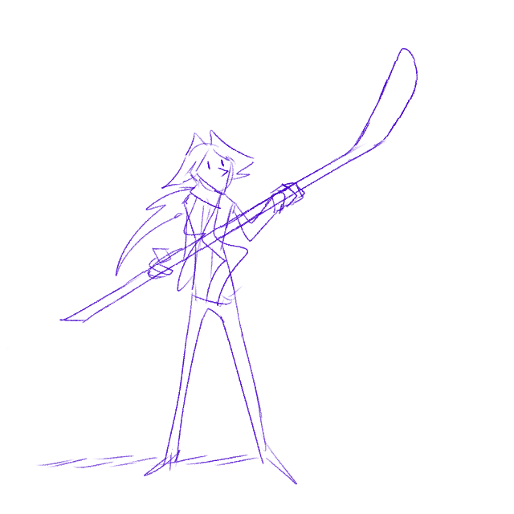
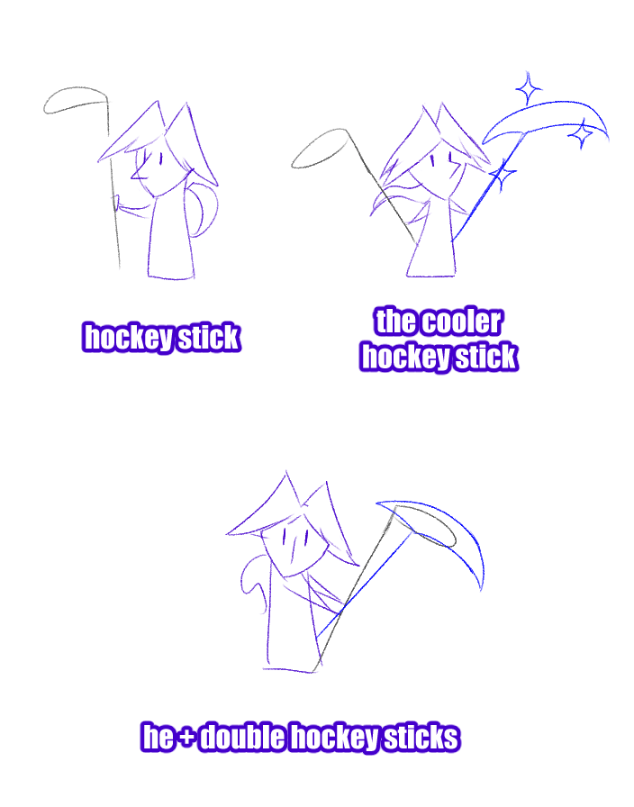

---
humorous:
  - high-sticking
  - The Cooler Daniel
tags:
  - hockey stick
  - vicerre
---

# Illustration 063 – Hockey Stick (2024-06-27)

## Overview

This image acts as a humorous follow-up to [Illustration 058](../2024-q2/2024-06-02_illustration-056_ice-scythe.md). In the previous image, I decided that Vic would transform his ice weapon from a bident to a scythe. Afterward, I realized hockey sticks were also associated with ice and could act like polearms. Due to this realization, I drew Vic holding a hockey stick.

## Design notes

- Fonts used: Impact Regular

## Bonus sketch (2024-07-15)

