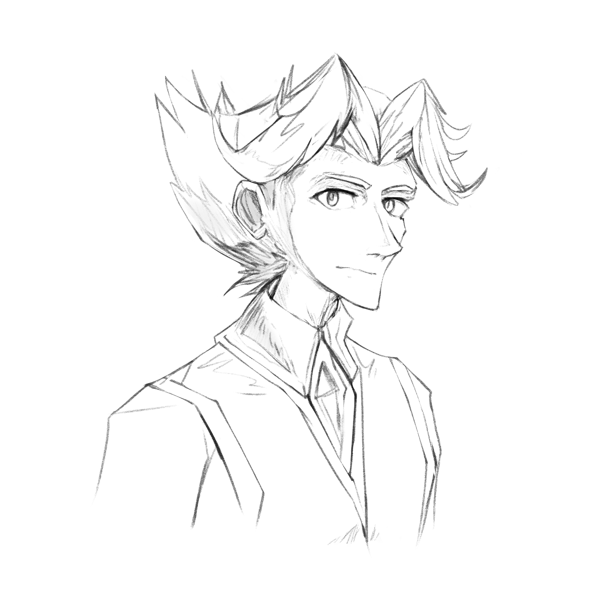

---
tags:
  - alis
---

# Rendition 064 – Semirealism (2024-07-23)

## Overview

The image in this post depicts an art study of Alis in a semirealistic style.

## Design notes

- Brushes used: Brush > Pastel > Pastel
- To make the image look sharper, I erased the thick parts of the outlines. The thick outlines made the drawing look blurry otherwise.

## WIPs

- [1](https://cdn.discordapp.com/attachments/261586968230494219/1265151248311517215/image.png)
