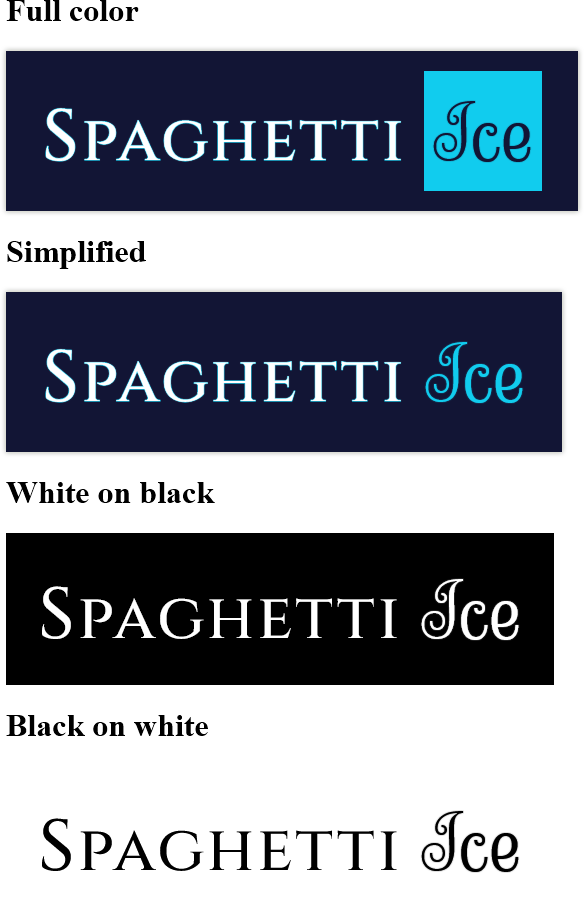

---
tags:
  - logo
  - typography
  - wordmark
---

# Meta 026 – Wordmark (2024-07-25)

## Overview

The images in these posts depict an exercise in which I designed a wordmark for the title of my blog. The wordmarks in this post are for educational purposes only and do not serve as design principles.

## Design notes

- The words in the titles of my work juxtapose one another. The first word in each title is variable, while the second is fixed. To match, I used two contrastive sets of styles between the first and second word.
  - For the first word, I used a serif font inspired by stone-etched [Roman square capitals](https://en.wikipedia.org/wiki/Roman_square_capitals).
  - For the second word, I used a cursive font inspired by the limp shape of spaghetti noodles.
- The words "Spaghetti" and "Ice" use fonts counterintuitively; the word "Spaghetti" is paired with the rigid serif font, and the word "Ice" is paired with the cursive font. This is due to the left-to-right reading order of the English language. As the reader reads the wordmark, the fonts used in the text "soften". This matches the transition in my universe's writing from something snappy to something wholesome.
- The full-color variation of the wordmark places the word "Ice" in a highlighted block. This highlighted block serves two purposes: it acts as a facsimile of a cursor highlight as one might see in a terminal, and it acts as a literal "block of ice".
- The word "Ice" is deliberately highlighted with the color with hex code `#1ce`.

## Resources used

<!--
Inspirations:

- [The Ellis School](https://www.theellisschool.org/)
- [Weisshouse](https://www.weisshouse.com/)
-->

Fonts used:

- [Sevillana](https://fonts.google.com/specimen/Sevillana)
- [Cal Roman Capitals](https://www.myfonts.com/products/regular-cal-roman-capitals-28303) → [Trajan](<https://en.wikipedia.org/wiki/Trajan_(typeface)>) → [Cinzel](http://joelcrawfordsmith.com/closest-font/font/trajan)

Fonts considered:

- [Arelina Script Bold](https://www.myfonts.com/products/bold-arelina-script-295620) (awkward overlap when using consecutive t's)
- [Pasta Script](https://www.myfonts.com/collections/pasta-script-font-just-in-type) (too spaghetti-like)

Miscellaneous:

- [Add stroke around text – on the outside – with css?](https://stackoverflow.com/questions/26634201/)
- [currentColor with opacity](https://stackoverflow.com/questions/45075231/)
- [How to capture an image of an HTML element, and maintain transparency?](https://stackoverflow.com/questions/6047407/)
- [How To Market A Game: Capsule](https://howtomarketagame.com/?s=capsule)
- [How to Make a Comic Book Cover](https://design.tutsplus.com/tutorials/--cms-32567)
- [Logo Design](https://blambot.com/pages/logo-design)
- [Logo design for comic advise](https://www.reddit.com/comments/i5j2t0/comment/g0r9mpl/)
