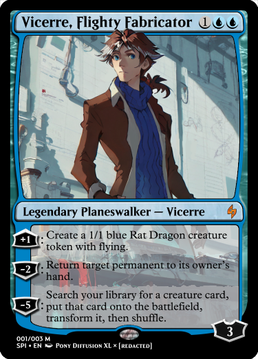

---
humorous:
  - Arcane Flight
  - Ensoul Artifact
  - How to Keep an Izzet Mage Busy
  - Inescapable Blaze
tags:
  - card
  - "Magic: The Gathering"
  - vicerre
---

# Meta 027 – _Magic: The Gathering_ Card

## Overview

I've been slowly familiarizing myself with _Magic: The Gathering_.

Initially, I learned about _Magic_ through YouTube channels that specialized in both _Yu-Gi-Oh!_ and _Magic_ [1](https://www.youtube.com/@CardmarketMagic), [2](https://www.youtube.com/@TheDuelLogs). From there, I discovered more about _Magic's_ art, gameplay, and lore from resources such as Reddit and TV Tropes. (Note that I have no plans to play the game myself.)

As I've learned about _Magic_, I've used it as a framework for thinking about casts of characters. The distribution of ideologies between "colors" matches well with the distribution of personality traits between characters, and being able to classify characters by ideology ensures a cast is well-rounded.

## Design notes

- When I decided to create an illustration of Vic in _Magic: The Gathering_'s signature style, I decided I would use Pony Diffusion XL. In doing so, I noticed the model's limitations. While an excellent model for generating characters, Pony struggles with scenes. Despite attempts, I have not been successful in using Pony to generate complex compositions.

## Game design notes

- Vic's gameplay identity centers around controlling which creatures are on the battlefield. Two of his abilities let you create small and large creatures, respectively. Alternatively, you can use another ability to dismiss one of your opponent's creatures.
- Flavor-wise, Vic best matches the design of a [Planeswalker](https://mtg.fandom.com/wiki/Planeswalker) card. Like Planeswalkers in lore, he has magical abilities unique to him, and like Planeswalkers in lore, the interdimensional portal in his lab mirrors their ability to cross dimensions. Overall, however, I don't consider Vic unique enough to be a Planeswalker.
- Vic's ability to create blue Rat tokens with flying is a reference to the lab rats he creates.
- Vic's ability to transform a creature he cheats out can be used to cheat out Solana. This is an intentional (albeit inefficient) synergy.
- The most intensive part of designing this card was in determining what Vic's Planeswalker epithet should be. _Magic_ cards abide by strict lore principles, and finding a terse but evocative epithet was a harder task than expected.
- In verifying that Vic's gameplay identity matched _Magic's_ color identity, I consulted the following articles:
  - [Mechanical Color Pie 2021](https://magic.wizards.com/en/news/making-magic/mechanical-color-pie-2021)
  - [MTG Fandom Wiki – Color](https://mtg.fandom.com/wiki/Color)
- I referenced [Scryfall's list of Planeswalkers](https://scryfall.com/search?q=type%3Aplaneswalker) to estimate the balance of +loyalty effects:
  - [Chandra, Flamecaller](https://scryfall.com/search?q=chandra+flamecaller)
  - [Ral, Crackling Wit](https://scryfall.com/search?q=ral+crackling+wit)
- I referenced [The Crafty Companion to Cheating out Creatures ](https://tappedout.net/mtg-decks/the-crafty-companion-to-cheating-out-creatures/) to estimate the balance of "cheat" mechanics:
  - [Bribery](https://scryfall.com/search?q=bribery)
  - [Eldritch Evolution](https://scryfall.com/search?q=eldritch+evolution)
  - [Nahiri, the Harbinger](https://scryfall.com/search?q=nahiri+the+harbinger)
- To determine whether this card should enter with three or four [loyalty counters](https://mtg.fandom.com/wiki/Loyalty), I consulted the card [Lightning Bolt](https://scryfall.com/search?q=lightning+bolt). I decided that Vic would be unlikely to survive a direct lightning bolt strike, so I set his starting loyalty to three.

<!-- Each sorcery spell you cast has replicate. The replicate cost is "Tap 2 artifacts you control." -->

## Workflow (Pony Diffusion XL)

- Positive prompt: `score_9, score_8_up, score_7_up, armin_vicerre, concept art, illustration, science lab, biology, complex background, blue red gradient, wide-angle shot`
- Negative prompt: `(worst quality, low quality: 1.4), 1girl, beakers, frame`
- Steps: 25
- Sampler: DDIM
- CFG scale: 8.0
- Seed: 682355909892370
- Size: 1152x896

## Resources used

- Adobe Photoshop CS6 (for final compositing)
- [Magic Set Editor](https://magicseteditor.boards.net/page/downloads)
- [Styles for Pony Diffusion V6 XL – Concept Art Eclipse](https://civitai.com/models/264290?modelVersionId=398292)
- [1](assets/2024-07-29_image-190.png)

## WIPs

- [1](https://cdn.discordapp.com/attachments/1208868988851847168/1267721479156666409/tmp4.png)
