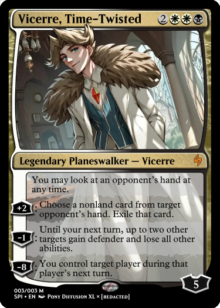

---
humorous:
  - It's so fluffy, I'm gonna die!
tags:
  - alis
  - card
  - hand knowledge
  - "Magic: The Gathering"
---

# Meta 028 – _Magic the Gathering_ Card

## Overview

A card depicting Alis in the style of _Magic: The Gathering_.

## Design notes

- The title of the card refers to Alis as "Vicerre". This is due to "Alistair" not working effectively as a name. "Alistair" is a normal (albeit old-fashioned) human name, so that doesn't match Planeswalker naming. "Alis" is a shortening, which feels too casual to use on a card title.
- My LoRA for Alis is far less reliable than my LoRA for Vic. I needed to prompt the Stable Diffusion model much more precisely to produce usable results. Rules the model had to abide by included the following:
  - Alis is not female. (The model would draw female characters at the slightest provocation.)
  - Alis's hair is brown or olive, not platinum blond.
  - Alis has a gem on his top, not a tie.
  - Alis wears a white longcoat, not a brown or green one.
- The keyword `florentine` does a remarkable amount of legwork in background image generation.

## Game design notes

- Alis's card identity centers around reading and controlling the opponent. His abilities to read and rip cards from an opponent's hand reflect his ability to manipulate characters' minds. His abilities to control a creature and the player reflect his ability to manipulate characters' actions.
- Like Vic, Alis is a Planeswalker due to his access to his interdimensional portal.
- I referenced Scryfall extensively in determining reasonable loyalty abilities for this card:
  - [Act of Aggression](https://scryfall.com/search?q=act+of+aggression)
  - [Agonizing Remorse](https://scryfall.com/sesarch?q=agonizing+remorse)
  - [Ashiok, Sculptor of Fears](https://scryfall.com/search?q=ashiok+sculptor+of+fears)
  - [Guard Duty](https://scryfall.com/search?q=guard+duty)
  - [Immovable Rod](https://scryfall.com/search?q=immovable+rod)
  - [Karn Liberated](https://scryfall.com/search?q=karn+liberated)
  - [Liliana Vess](https://scryfall.com/search?q=liliana+vess)
  - [Sorin Markov](https://scryfall.com/search?q=sorin+markov)
  - [Thoughtseize](https://scryfall.com/search?q=thoughtseize)
  - [Will Menrith](https://scryfall.com/search?q=will+kenrith)
- Unlike Vic, who enters with three loyalty, Alis enters with four. The logic for Alis's value is the same as the logic for Vic's; given his neurological abilities, he would stand a better chance of surviving a Lightning Bolt.
- There is no particular reason all of his abilities change loyalty by an even number; this just came about as a byproduct of how I weighted the strength of each ability.

## Workflow (Pony Diffusion XL)

- Positive prompt: `score_9, score_8_up, score_7_up, score_6_up, score_5_up, score_4_up, source_anime, alistair_vicerre, illustration, florentine, indoors, complex background, looking at viewer, sinister expression, brown, white longcoat, wide-angle shot`
- Negative prompt: `(worst quality, low quality: 1.4), 1girl, dress, frame, framed, throne, tie`
- Steps: 25
- Sampler: DDIM
- CFG scale: 8.0
- Seed: 13831901474795
- Size: 1152x896

## Resources used

- [Free AI image extender?](https://www.reddit.com/comments/17c8lue/)
- [Reveal hand vs look at hand](https://www.reddit.com/comments/u6kr5v/)
- [How strong is looking at your opponents' hands?](https://www.reddit.com/comments/byl5w3/)
- [why are "reveal opponents hand" effects so cheap in magic?](https://www.reddit.com/comments/9ofcwg/)
- [1](assets/2024-07-31_image-192.png)

## WIPs

- [1](https://cdn.discordapp.com/attachments/1208868988851847168/1268442624499646545/2024-07-31_image-192.png)
