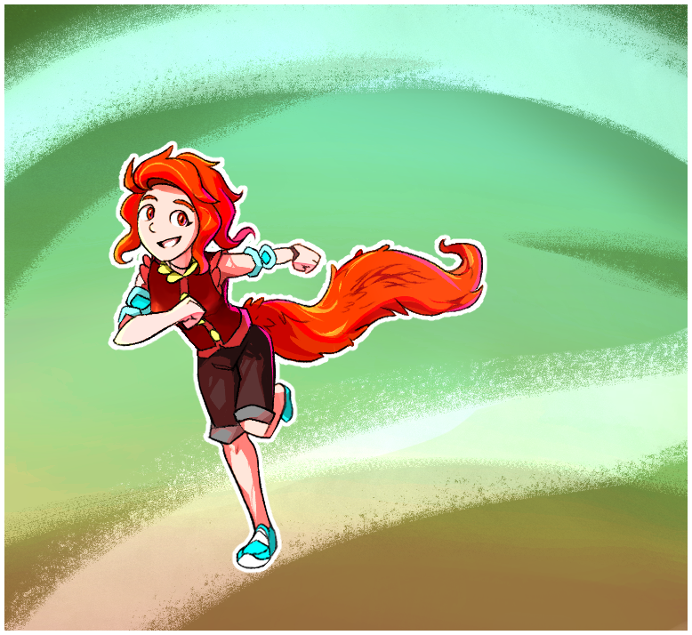

---
tags:
  - solana
---

# Rendition 065 – Solana (2024-08-02 – 2024-08-03)

## Overview

A colored drawing of Solana to use as LoRA training data. The image depicts her in an active pose.

## Workflow (Counterfeit-V3.0)

- Positive prompt: `masterpiece, solora, (figurine: 1.2), 1girl, solo`
- Negative prompt: `(worst quality, low quality: 1.4)`
- Steps: 20
- Sampler: DDIM
- CFG scale: 8.0
- Seed: 640455880014228
- Size: 768x768

## Resources used

- [1](assets/2023-12-30_image-181.png)

## WIPs

- [1](https://cdn.discordapp.com/attachments/1208868988851847168/1269307467423027361/image.png)
- [2](https://cdn.discordapp.com/attachments/1020875112045613217/1269399236936601662/image.png)
