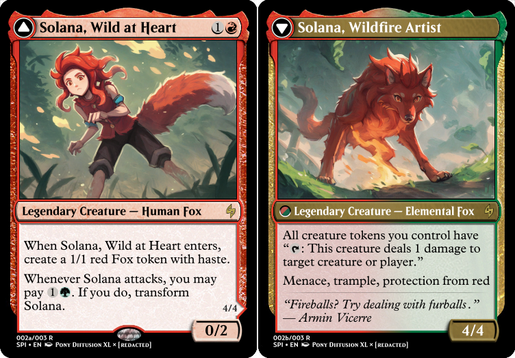

---
humorous:
  - Chandra's Embercat
tags:
  - "Magic: The Gathering"
  - solana
---

# Meta 029 – _Magic: The Gathering_ Card (2024-08-05)

## Overview

A card depicting Solana in the style of _Magic: The Gathering_.

## Design notes

- Designing Solana as a [transform](https://mtg.fandom.com/wiki/Transform) card presented itself with its own set of difficulties. Not only did I need to generate an image of her in an alternate form, but I also had to make sure both images generated matched each other and the styling of the card frame. This task wasn't so much strenuous as it was tedious trying to find the right keywords to generate desirable results.
- The two titles of Solana's forms are designed to mirror each other, as they both share the words "wild" and "art".

## Game design notes

- Personality-wise, the best color identity for Solana is green, as she is flexible and fond of nature. Gameplay-wise, however, the best color identity for Solana is red, as fire magic translates to red spells.
- I referenced [the Fandom Wiki page on evergreen mechanics](https://mtg.fandom.com/wiki/Evergreen) in determining reasonable keywords to give this card.
- I referenced the following cards in determining power level for this card:
  - [Alluring Suitor](https://scryfall.com/search?q=alluring+suitor+deadly+dancer)
  - [Arlinn Kord](https://scryfall.com/search?q=arlinn+kord+arlinn+embraced+by+the+moon)
  - [Doric, Nature's Warden](https://scryfall.com/search?q=doric+natures+warden+doric+owlbear+avenger)

<!--
- All other Foxes you control get +1/+1.
-->

## Resources used

- [Useful Magic Set Editor (MSE) Tips](https://www.tumblr.com/inkubatorpl/138998912903/)
- [1](assets/2024-08-05_image-196.png)
- [2](assets/2024-08-05_image-197.png)

## Workflow (Pony Diffusion XL, Front)

- Positive prompt: `score_9, score_8_up, score_7_up, score_6_up, score_5_up, score_4_up, source_anime, solana_sie, solo, feral female (dire: 1.2) (fox: 0.6) vulpine werewolf wolf, bare, burning, glow, messy tawny fur, (missing mouth: 1.2), (perspective: 1.2), (small nose: 1.2), underlighting, lush background`
- Negative prompt: `(worst quality, low quality: 1.4), source_cartoon, source_furry, source_pony, 1boy, 1girl, anthro, notched, person, ring`
- Steps: 25
- Sampler: DDIM
- CFG scale: 8.0
- Seed: 720702750190745
- Size: 1152x896

## Workflow (Pony Diffusion XL, Back)

- Positive prompt: `score_9, score_8_up, score_7_up, score_6_up, score_5_up, score_4_up, source_anime, solana_sie, solo, feral female (dire: 1.2) (fox: 0.6) vulpine werewolf wolf, bare, burning, glow, messy tawny fur, (missing mouth: 1.2), (perspective: 1.2), (small nose: 1.2), lush background`
- Negative prompt: `(worst quality, low quality: 1.4), source_cartoon, source_furry, source_pony, 1boy, 1girl, anthro, notched, person, ring`
- Steps: 25
- Sampler: DDIM
- CFG scale: 8.0
- Seed: 118413361163961
- Size: 1152x896

## WIPs

- [1](https://cdn.discordapp.com/attachments/1208868988851847168/1270193647610101792/tmp2.png)
