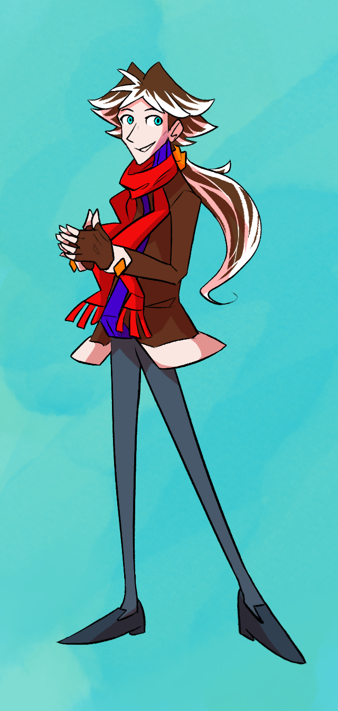

---
tags:
  - vicerre
---

# Rendition 067 – Vicerre Geometric (2024-08-20 – 2024-08-21)

## Overview

I thought [my last image of Vic](2024-08-13_illustration-065_reference.md) looked too "domestic", so I redrew him in a simpler and more polygonal style.

## Design notes

Compared to other drawings, I struggled with drawing Vic's face accurately. Initially, his face looked too child-like, and I needed to adjust facial features to make him look older. In this process, I learned about which features make a character look younger or older. Features I needed to adjust include:

- head shape (younger = rounder, older = longer)
- cheek prominence (younger = more prominent, older = less prominent)
- eye size (younger = larger, older = smaller)
- iris size (younger = larger, older = smaller)
- pupil size (changes expression)

## WIPs

- [1](https://cdn.discordapp.com/attachments/261586968230494219/1275878557666770966/image.png)
